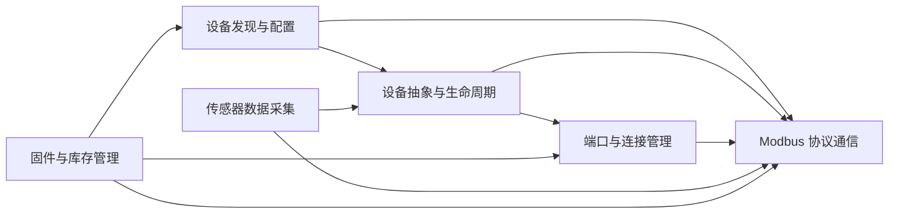

# 领域模型：6个领域模型

## 固件与库存管理

管理Modbus设备的固件信息查询和库存数据管理。通过device_firmware查询固件版本，通过modbus_inventory管理设备库存信息。

**Entities**

- DeviceFirmware

- ModbusInventory

**Business Rules**

- 固件信息通过Modbus协议查询

- 库存信息基于设备白名单管理

- 固件与库存数据通过端口访问设备

**Cross Domain**

- 依赖 _[Modbus协议通信域](#Modbus协议通信)_ 进行数据查询

- 依赖 _[端口管理域](#端口与连接管理)_ 建立连接

- 依赖 _[设备发现与配置管理域](#设备发现与配置管理)_ 获取设备列表

**FLOWs**

1. 固件信息查询流程

    查询版本 —— 返回数据

2. 库存信息管理流程 

    查询库存 —— 更新数据

## 设备发现与配置管理

负责发现Modbus设备、加载设备配置文件、解析设备白名单，并协调设备生命周期。通过device_manager统一管理设备注册、配置加载和状态监控。

**Entities**

- DeviceManager

- BaseConfig

- DeviceProfile

- AllowedDevices

- EntityManagerInterface

**Business Rules**

- 设备必须通过白名单校验才能被管理

- 设备配置文件必须符合device_profile.schema

- 设备配置通过Entity Manager接口下发

**Cross Domain**

- 依赖 _[Modbus协议通信域](#Modbus协议通信)_ 进行设备交互

- 依赖 _[设备抽象域](#设备抽象与生命周期)_ 创建设备实例

- 依赖 _[端口管理域](#端口与连接管理)_  建立物理连接

**FLOWs**

3. 设备发现流程

    Entity Manager配置 —— 白名单校验 —— 设备注册

4. 设备配置加载流程

    解析配置 —— schema校验 —— 设备初始化

## 设备抽象与生命周期

提供设备抽象基类、设备配置、设备工厂和工具函数。设备工厂根据配置创建具体设备实例，管理设备的状态、事件和寄存器区间。

**Entities**

- BaseDevice

- DeviceConfig

- DeviceFactory

- DeviceUtils

- RegisterSpan

**Business Rules**

- 设备工厂根据配置创建设备实例

- 设备通过RegisterSpan管理寄存器区间

- 设备实践通过events系统发布

**Cross Domain**

- 依赖 _[Modbus协议通信域](#Modbus协议通信)_ 进行数据交互

- 依赖 _[设备发现与配置管理域](#设备发现与配置管理)_ 获取配置

- 依赖 _[端口管理域](#端口与连接管理)_ 建立连接

**FLOWs**

5. 设备实例化流程

    工厂创建 —— 寄存器区间 —— 关联端口

6. 设备事件处理流程

    状态监控 —— 事件发布 —— 通知监听者

## 端口与连接管理

抽象串口/USB端口访问，提供端口工厂创建端口实例，支持USB端口实现。管理物理连接的生命周期和通信通道。

**Entities**

- BasePort

- UsbPort

- PortFactory

**Business Rules**

- 端口工厂根据配置创建端口实例

- USB端口继承基础端口接口

- 端口依赖Modbus协议进行通信

**Cross Domain**

- 被 _[设备抽象域](#设备抽象与生命周期)_ 用于建立物理连接

- 被 _[固件与库存管理域](#固件与库存管理)_ 用于数据访问

- 依赖 _[Modbus协议通信域](#Modbus协议通信)_ 进行数据交换

**FLOWs**

7. 端口连接建立流程

    创建端口 —— 打开连接 —— 配置通信

## Modbus协议通信

实现MOdbus RTU协议的消息编码、命令执行和异常处理。提供Modbus主入口、modbus_commands命令执行器和modbus_message消息封装。

**Entities**

- Modbus

- Modbus Commands

- ModbusMessage

- ModbusException

**Business Rules**

- 遵循Modbus RTU协议规范

- 命令执行基于消息封装

- 异常通过ModbusException处理

**Cross Domain**

- 被 _[设备抽象域](#设备抽象与生命周期)_ 调用进行数据读写

- 被 _[端口管理域](#端口与连接管理)_ 用于串口通信

- 被 _[固件与库存管理域](#固件与库存管理)_ 用于数据查询

**FLOWs**

8. Modbus命令执行流程

    构建请求 —— 发送 —— 接收 —— 解析响应

9. Modbus消息处理流程

    编码帧 —— 解码帧 —— 异常处理

## 传感器数据采集

负责采集Modbus设备的传感器数据，通过事件系统发布数据变化，使用寄存器区间管理传感器数据映射。

**Entities**

- Events

- RegisterSpan

- SensorBase

**Business Rules**

- 传感器数据通过事件系统发布

- 寄存器区间映射传感器数据

- 数据变化出发事件通知

**Cross Domain**

- 依赖 _[设备抽象域](#设备抽象与生命周期)_ 获取设备数据

- 依赖 _[Modbus协议通信域](#Modbus协议通信)_ 读取寄存器

- 与 _[设备发现与配置管理域](#设备发现与配置管理)_ 共享设备状态

**FLOWs**

10. 传感器数据采集流程

    读寄存器 —— 映射数据 —— 发布事件

# 层级模型：

## 公共基础设施层

**entity_manager_interface**

.hpp : Entity Manager的D-Bus接口封装，监听库存对象的添加/移除信号，获取设备配置。

.cpp : 实现EntityManagerInterface，通过GetManagedObjects和InterfacesAdded/Removed信号发现设备配置。

**events**

.hpp : Redfish事件生成接口，支持传感器读数、故障、电源故障、泄漏检测等事件。

.cpp : 实现事件生成与持久化，管理待处理事件映射，支持事件恢复。

**notify_watch**

.hpp : 基于inotify的文件监视器，用于监听配置文件变化。

.cpp : 实现inotify文件监视，异步读取通知并触发回调。

**register_span**

.hpp : 寄存器跨度结构，将寄存器合并为连续跨度以支持批量读取。

.cpp : 实现buildRegisterSpans，将寄存器按偏移排序并合并为连续跨度。

## RTU配置层

**allowed_devices**

.hpp : 设备白名单，限制允许连接的Modbus设备。

.cpp : 实现设备白名单加载与监视，支持配置文件热更新。

## RTU核心层

**base_config**

.hpp : 所有Modbus RTU设备的基础配置，包括名称、类型、地址、串口、轮询率等。

.cpp : 从Entity Manager属性读取配置并查找设备配置文件，构建Config

**device_manager**

.hpp : 设备管理器，协调端口、库存设备与Modbus设备的创建与生命周期。

.cpp : 实现设备发现，配置处理、设备创建与清理，包含程序入口main()

**device_profile**

.hpp : 设备配置文件结构，定义传感器、状态、库存、固件、配置等寄存器。

.cpp : 解析JSON设备配置文件为类型化结构，提供getDeviceProfile等查询函数。

## 设备抽象层

**base_device**

.hpp : Modbus设备基类，轮询传感器/状态/指标寄存器并发布到D-Bus

.cpp : 实现传感器/指标创建、轮询桶构建、寄存器跨度读取与事件生成。

**device_config**

.hpp : 设备配置结构，扩展基础配置。

.cpp : 实现设备配置处理。

**device_factory**

.hpp : 设备工厂，创建Modbus设备实例

.cpp : 实现设备工厂，根据配置创建BaseDevice

**device_utils**

.hpp : 设备工具函数

.cpp : 实现设备工具函数

## 库存管理层

**modbus_inventory**

.hpp : 库存设备，探测Modbus设备并创建库存D-Bus对象

.cpp : 实现设备探测循环、库存对象创建与休眠管理

## 固件管理层

**device_firmware**

.hpp : 设备固件管理，读取固件版本寄存器并发布到D-Bus

.cpp : 实现固件版本读取与D-Bus发布

## Modbus协议层

**modbus**

.hpp : Modbus RTU协议封装，提供读/写保持寄存器操作

.cpp : 实现Modbus RTU协议，配置串口参数、RS485、读写寄存器

**modbus_commands**

.hpp : Modbus命令类，定义读/写保持寄存器请求与响应

.cpp : 实现Modbus命令编码与解码

**modbus_message**

.hpp : Modbus消息类，支持字节流编码/解码与CRC校验

.cpp : 实现Modbus消息编码/解码与CRC生成

## 端口抽象层

**base_port**

.hpp : 串口基类，提供读/写保持寄存器操作与独占锁机制。

.cpp : 实现串口读写操作、独占锁与忙状态管理。

**port_factory**

.hpp : 端口工厂，创建串口实例

.cpp : 实现端口工厂，根据配置创建BasePort

**usb_port**

.hpp : USB串口实现

.cpp : 实现USB串口

## 测试层

**mock_modbus_server**

模拟Modbus服务器，用于测试设备交互

**modbus_server_tester**

实现Modbus服务器测试辅助类

**test_metrics**

指标寄存器测试

**test_sensor_lifecycle**

传感器生命周期测试

**test_sensors**

传感器测试

**test_config_registers**

配置寄存器测试

**test_allowed_devices**

ALlowedDevices白名单测试

**test_device_profile**

根据配置文件测试

**test_firmware**

固件管理测试

**test_inventory**

库存设备探测测试

**test_port**

串口测试

**test_register_span**

寄存器跨度测试

**test_events**

事件生成测试

**test_modbus_commands**

Modbus命令测试

**test_modbus**

Modbus协议测试

**test_base**

测试基类

**test_sensor_base**

传感器基类测试辅助
