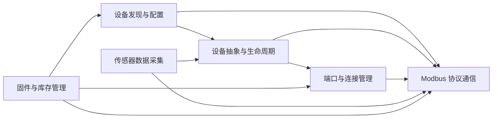

# 6个领域

## 固件与库存管理

**Entities**

- DeviceFirmware

- ModbusInventory

**Business Rules**

- 固件信息通过Modbus协议查询

- 库存信息基于设备白名单管理

- 固件与库存数据通过端口访问设备

**Cross Domain**

- 依赖 _Modbus协议通信域_ 进行数据查询

- 依赖 _端口管理域_ 建立连接

- 依赖 _设备发现与配置管理域_ 获取设备列表

**FLOWs**

1. 固件信息查询流程

查询版本 —— 返回数据

2. 库存信息管理流程 

查询库存 —— 更新数据

