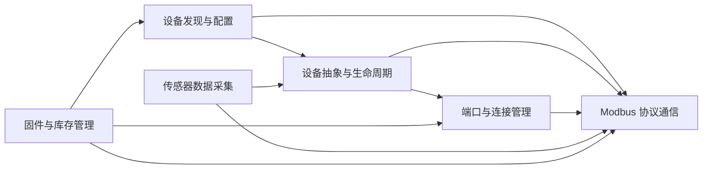

# 6个领域模型

## 固件与库存管理

管理Modbus设备的固件信息查询和库存数据管理。通过device_firmware查询固件版本，通过modbus_inventory管理设备库存信息。

**Entities**

- DeviceFirmware

- ModbusInventory

**Business Rules**

- 固件信息通过Modbus协议查询

- 库存信息基于设备白名单管理

- 固件与库存数据通过端口访问设备

**Cross Domain**

- 依赖 _[Modbus协议通信域](#Modbus协议通信)_ 进行数据查询

- 依赖 _[端口管理域](#端口与连接管理)_ 建立连接

- 依赖 _[设备发现与配置管理域](#设备发现与配置管理)_ 获取设备列表

**FLOWs**

1. 固件信息查询流程

    查询版本 —— 返回数据

2. 库存信息管理流程 

    查询库存 —— 更新数据

## 设备发现与配置管理

负责发现Modbus设备、加载设备配置文件、解析设备白名单，并协调设备生命周期。通过device_manager统一管理设备注册、配置加载和状态监控。

**Entities**

- DeviceManager

- BaseConfig

- DeviceProfile

- AllowedDevices

- EntityManagerInterface

**Business Rules**

- 设备必须通过白名单校验才能被管理

- 设备配置文件必须符合device_profile.schema

- 设备配置通过Entity Manager接口下发

**Cross Domain**

- 依赖 _[Modbus协议通信域](#Modbus协议通信)_ 进行设备交互

- 依赖 _[设备抽象域](#设备抽象与生命周期)_ 创建设备实例

- 依赖 _[端口管理域](#端口与连接管理)_  建立物理连接

**FLOWs**

3. 设备发现流程

    Entity Manager配置 —— 白名单校验 —— 设备注册

4. 设备配置加载流程

    解析配置 —— schema校验 —— 设备初始化

## 设备抽象与生命周期

提供设备抽象基类、设备配置、设备工厂和工具函数。设备工厂根据配置创建具体设备实例，管理设备的状态、事件和寄存器区间。

**Entities**

- BaseDevice

- DeviceConfig

- DeviceFactory

- DeviceUtils

- RegisterSpan

**Business Rules**

- 设备工厂根据配置创建设备实例

- 设备通过RegisterSpan管理寄存器区间

- 设备实践通过events系统发布

**Cross Domain**

- 依赖 _[Modbus协议通信域](#Modbus协议通信)_ 进行数据交互

- 依赖 _[设备发现与配置管理域](#设备发现与配置管理)_ 获取配置

- 依赖 _[端口管理域](#端口与连接管理)_ 建立连接

**FLOWs**

5. 设备实例化流程

    工厂创建 —— 寄存器区间 —— 关联端口

6. 设备事件处理流程

    状态监控 —— 事件发布 —— 通知监听者

## 端口与连接管理

抽象串口/USB端口访问，提供端口工厂创建端口实例，支持USB端口实现。管理物理连接的生命周期和通信通道。

**Entities**

- BasePort

- UsbPort

- PortFactory

**Business Rules**

- 端口工厂根据配置创建端口实例

- USB端口继承基础端口接口

- 端口依赖Modbus协议进行通信

**Cross Domain**

- 被 _[设备抽象域](#设备抽象与生命周期)_ 用于建立物理连接

- 被 _[固件与库存管理域](#固件与库存管理)_ 用于数据访问

- 依赖 _[Modbus协议通信域](#Modbus协议通信)_ 进行数据交换

**FLOWs**

7. 端口连接建立流程

    创建端口 —— 打开连接 —— 配置通信

## Modbus协议通信

实现MOdbus RTU协议的消息编码、命令执行和异常处理。提供Modbus主入口、modbus_commands命令执行器和modbus_message消息封装。

**Entities**

- Modbus

- Modbus Commands

- ModbusMessage

- ModbusException

**Business Rules**

- 遵循Modbus RTU协议规范

- 命令执行基于消息封装

- 异常通过ModbusException处理

**Cross Domain**

- 被 _[设备抽象域](#设备抽象与生命周期)_ 调用进行数据读写

- 被 _[端口管理域](#端口与连接管理)_ 用于串口通信

- 被 _[固件与库存管理域](#固件与库存管理)_ 用于数据查询

**FLOWs**

8. Modbus命令执行流程

    构建请求 —— 发送 —— 接收 —— 解析响应

9. Modbus消息处理流程

    编码帧 —— 解码帧 —— 异常处理

## 传感器数据采集

负责采集Modbus设备的传感器数据，通过事件系统发布数据变化，使用寄存器区间管理传感器数据映射。

**Entities**

- Events

- RegisterSpan

- SensorBase

**Business Rules**

- 传感器数据通过事件系统发布

- 寄存器区间映射传感器数据

- 数据变化出发事件通知

**Cross Domain**

- 依赖 _[设备抽象域](#设备抽象与生命周期)_ 获取设备数据

- 依赖 _[Modbus协议通信域](#Modbus协议通信)_ 读取寄存器

- 与 _[设备发现与配置管理域](#设备发现与配置管理)_ 共享设备状态

**FLOWs**

10. 传感器数据采集流程

    读寄存器 —— 映射数据 —— 发布事件