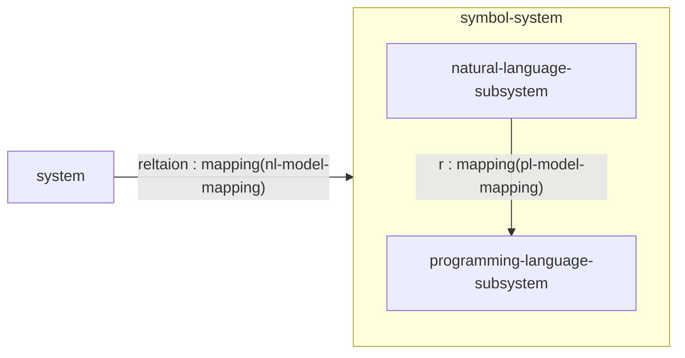

# Take modbus for an example to utilize the method

[modbus domain model](../../communication-protocol/modbus/modbus_domain_model.md)

## Meta



mapping provided by the subsystem of a system mapped to

mapping can be recognized by the system

mapping preserve the mapping relationship

## Use Ubiqutiou Language to Modelling the domain model

### step 1 mapping from system domain model to natural language

**mapping relationship**

domain model -> natural language

static part -> entity, value object, ,architecture, aggregate, module, association

dynamic part -> operation, domain event, state transition, domain service, invariant(rules)

**how to determine _Architecture_**

use-case-driven method, then constraint it to:

- function requirements

- domain model specific scenarios

from easy to hard:

Layers → DIP → Hexagonal → SOA → REST → CQRS → Event-Driven → Sagas → Event Sourcing

| 架构风格 | 何时使用（书中案例） | 缓解的风险 |
| --- | --- | --- |
| Layers（分层） | 简单客户端-服务器，单一应用层+中央数据库 | 简单场景的基础架构 |
| DIP（依赖倒置） | 需要测试质量时，可替换 UI 和持久化 | 测试困难、技术耦合 |
| Hexagonal（六边形/端口适配器） | 需要支持多种客户端（桌面、移动）、多种持久化（NoSQL、消息） | 客户端和输出机制多样性 |
| SOA（面向服务） | 需要聚合来自遗留系统的数据、服务边界 | 数据聚合、服务集成 |
| REST | 需要支持移动设备、松耦合、高扩展 | 客户端多样性、耦合 |
| CQRS（命令查询职责分离） | 用户界面视图跨多个聚合、视图复杂 | 视图查询复杂、命令/查询摩擦 |
| Event-Driven（事件驱动） | 需要分布式处理、长运行任务、避免超时 | 分布式处理复杂性 |
| Pipes and Filters（管道过滤器） | 需要运行一系列分布式进程 | 长运行任务 |
| Sagas（长运行进程） | 需要分布式和并行化管道过滤器 | 分布式处理扩展 |
| Event Sourcing（事件溯源） | 需要追踪每个变更（合规要求） | 审计、合规、状态重建 |

**How to determine entities? What features?**

criterion: 
    - care about individuality? (identity distinguishes it from all others)
    - mandatory constraint to distinguish it?
    - changes over time but identity stays same?
  → if yes, it's an Entity (not a Value Object)

What features?
  - unique identity (user-provided / app-generated / persistence-generated / other-BC-assigned)
  - identity stability (immutable, guarded)
  - mutability (state changes, identity stays)
  - roles & responsibilities (single responsibility)
  - validation (attribute / whole-object / composition levels)

**How to determine value objects? What features?**

How to determine value objects?
  criterion:
    - care only about attributes? (not identity)
    - measures / quantifies / describes a thing?
    - can be maintained as immutable?
    - models a conceptual whole (related attributes as integral unit)?
    - completely replaceable when measurement/description changes?
    - compared with Value equality?
    - supplies Side-Effect-Free Behavior?
  → if most of these, it's a Value Object (not an Entity)

What features?
  - measures / quantifies / describes (not a "thing")
  - immutable (unchangeable after creation)
  - conceptual whole (attributes form integral unit, atomic construction)
  - replaceable (whole replacement, not mutation)
  - value equality (equals + hashCode by attributes)
  - side-effect-free behavior (query methods, CQS)


**How to determine services? What features?**

  criterion:
    - operation feels out of place as a method on an Entity/Value Object?
    - performs a significant business process?
    - transforms a domain object from one composition to another?
    - calculates a Value requiring input from more than one domain object?
    - houses business logic (not application logic)?
  → if yes, model as a Domain Service (stateless)
  → caution: avoid overuse → Anemic Domain Model

What features?
  - stateless (no state, independent per call)
  - interface in Ubiquitous Language (operation name is part of UL)
  - houses business logic (not in Application Service)
  - handles multiple domain objects in single atomic operation
  - may use Repositories (but Aggregates shouldn't access Repositories)
  - Separated Interface only for technical services (e.g. encryption)

**How to determine events? What features?**

How to determine events?
  criterion:
    - something happened that domain experts care about?
    - a discrete, past occurrence in the domain?
    - needs to be recorded / notified / subscribed?
    - domain experts say "When... / If that happens... / Notify me if... / An occurrence of..."?
  → if yes, model as a Domain Event
  → caution: disregard happenings experts/business don't care about

What features?
  - named in past tense (derived from the command that caused it)
  - timestamp (occurredOn) - minimal DomainEvent interface
  - properties to trigger the event again (Aggregate identity, involved Aggregates, cause parameters)
  - immutable (full state init in constructor, read-only accessors)
  - interface conveys the cause
  - publish/subscribe (Aggregates publish, subscribers consume) for eventual consistency

**_core : how to reach the natural language_**

```
01 classify bounded context

criterion : model changing stage with time and space, every stage is the main bounded context, and can be divided into more bounded contexts.

02 make context map

paint the mapping's static and dynamic part:

static part : inside natural language, how they are organized

dynamic part : inside nl, how they are changed

03 determine architecture

architecture is not a grab bag of cool tools

criterion : 

- only to lower specific risks can use architecture

- every architecture must be proved reasonable, or do not use it

- avoid over using of architecture style and patterns

```

### step 2 mapping from nl to pl

