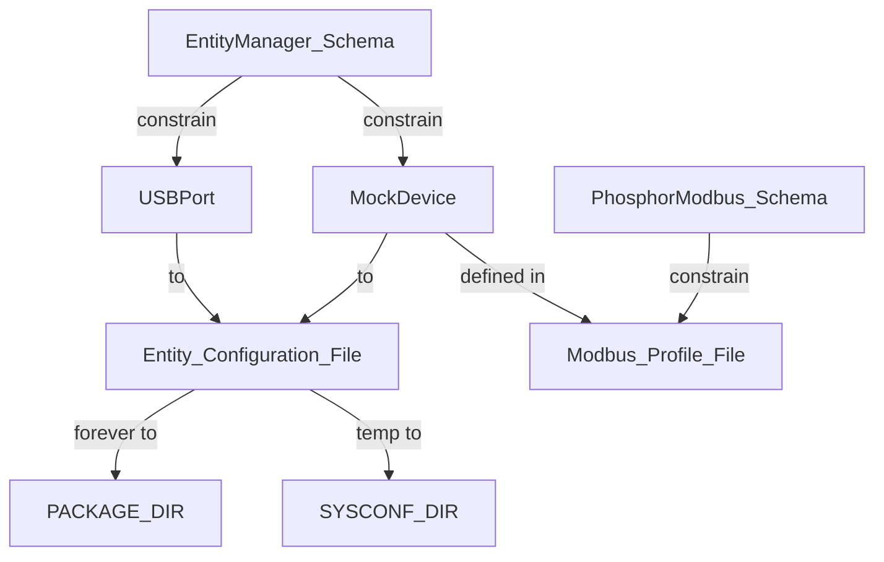

# Workflow

[最重要的事情：加缓存](#加缓存)

[最重要的事情二：浅克隆](#bitbake浅克隆)

## 1 From recipes to openbmc

### configure the openbmc to support new hardware


### build a needed service into image

1.find recipes file *.bb

take _entity manager_ for example

`bitbake-layers show-recipes | grep -i entity`

note : the name correspond to *.bb's name

2.build alone to test is ok

`bitbake entity-manager`

3.add to imgae in /conf/local.conf

`IMAGE_INSTALL:append = " entity-manager"`

4.build 

`bitbake obmc-phosphor-image`

5.check service status (name found in [find services in open bmc](#find-services-in-openbmc))

`systemctl status <service name>`

6.check log

`journalctl -u <service name> --no-pager`

### find services in openbmc 

`ls -l /etc/systemd/system/multi-user.target.wants`

### start an env on host machine

open venv `conda activate openbmc`

`source oe-init-build-env`

`runqemu evb-ast2600 nographic slirp`

### service exec file in openbmc

ls /usr/libexec/

### add configuration into image

put configuarion in the source repo corresponding to the schemas.

## 2 Use openbmc to develop business

## A phosphor-modbus


### the use of phosphor-modbus on qemu

1.install dependencies on openbmc

this can find in service file

2.check the service whether starting or not  

3.install needed (also the same install process [ref](#build-a-needed-service-into-image))

4.copy needed file to qemu

needed file to be found at the source repo or something else

example for create file or remote operation on qemu

`ssh -p 2222 root@127.0.0.1 \
  'mkdir -p /usr/local/bin && chmod 755 /usr/local/bin'`

example for scp files

`scp -P 2222 \
  openbmc/phosphor-modbus/mocked_test_device/start_mock_server.sh \
  root@127.0.0.1:/usr/local/bin/start_mock_server.sh`

5.start script of mock server

6.ssh this qemu in other terminal

check the log to see whether service starts successfully, but it doesn't represent the happening of Modbus communication, must have entity manager configruation of USBPort and Modbus device.

`ls -l /dev/ttyUSB* /dev/ttyV*`
`ls -l /dev/serial/by-path/`

check entity manager whether publish USBPort and Modbus configuration

`busctl tree xyz.openbmc_project.EntityManager`

7.EntityManager doesn't publish USBPort

[add configuration into image](#add-configuration-into-image)

### only use openbmc service

## B entity manager

### how to publish usbport forever / temp

[add configuration into image](#add-configuration-into-image)

then use the repo tool to generate meson.build:

`/scripts/generate_config_list.sh`

**tmp :** 

put configuration in /etc/entity-manager/configurations

after execute start_mock_server.sh 1, need to add a configuration file according to schema usb_port.json.

this command may be helpful after execting script:

`ls -l /dev/serial/by-path/`

`systemctl restart xyz.openbmc_project.EntityManager.service`

`busctl tree xyz.openbmc_project.EntityManager`

### configuration dir in openbmc

PACKAGE_DIR : /usr/share/entity-manager/configurations : repo source configuration

PACKAGE_DIR : /usr/share/entity-manager/schema : repo source schema

SYSCONF_DIR : /etc/entity-manager/configurations : temp configuration

/var/configuration/system.json : entity-manager runtime configuration dir 

/tmp/configuration/last.json : last configuration or called cache , generated according to system.json

### add a mock device file under modbus profile

this profile need to follow schema

/usr/share/phosphor-modbus/profiles/name.json

name = Type field defined in entitymanager configuration file

### a process mock in qemu



### a problem 01 : always no load exposes

reason : the first time i configure a wrong configuration file , and when it runs loading to system.json, and cached to last.json, i only delete last.json, but need to delete system.json at the same time.

### a problem 02 : modbusrtu service start error

occured DeviceLocation do not match error.

from "1" in configuration file to number 1 in system.json.

reason : the binary version of phosphor-dbus-interface and phosphor-modbus doesn't match.

## 3 Revise Web app


## 4 修改内核配置树

### 4.1 开发调试阶段需要频繁烧录镜像验证

**01 将镜像scp到BMC**

`scp ~/obmc/.../deploy/image/... root@<BMC_IP>:/tmp`

**02 查看当前Flash分区**

`cat /proc/mtd`

**03 写入整个Flash**

`flashcp -v /tmp/... /dev/mtdN`

### 4.2 查看OpenBMC配置了哪些串口

**列出所有串口设备**

`ls -l /dev/ttyS*`

**查看内核识别到的串口及中断**

需要对照AST2600的数据手册查看内存地址

`cat /proc/tty/deriver/serial`

**查看系统日志中UART驱动探测记录**

`dmesg | grep -i tty`

`dmesg | grep -i uart`

**查看pinctrl当前状态：确认UART是否绑定到正确引脚组**

`cat /sys/kernel/debug/pinctrl/*/pinmux-pins 2>/dev/null | grep -i uart`

**直接用stty测试某个tty是否能设置波特率**

不能设置则说明未启用

`stty -F /dev/ttyS4 115200`

**查看obmc-console暴露了哪些console实例**

查看配置文件

`cat /etc/obmc-console/*.conf`

查看当前运行的console服务

`ps | grep -i obmc-console`

查看systemd单元

`systemctl status 'obmc-console@*'`

查看日志文件，每个host console一个

`ls -l /var/log/console-*.log`

`ls -l /var/log/obmc-cons*.log`

通过dbus查询

`busctl --list |grep -i console`

### 4.3 新增/修改UART配置Workflow

step 01 - 设备树.dts：开启对应uart节点，并配置正确的pinctrl组

step 02 - obmc-console配置：添加新的console实例段


### 4.4 怎么配置openbmc的内核

**开发阶段**

**01 进入工作区并checkout内核源码**

`cd openbmc`

`. setup evb-ast2600`

`devtool modify linux-aspeed` > build/workspace/sources/linux-aspeed/

**02 修改内核代码或配置**

`cd build/workspace/sources/linux-aspeed/`

`revise kernel kconfig`

`git add ...`

`git commit -s -m "msg"`

**03 交互式修改内核配置**

**打开ncurses配置界面**

`bitbake linux-aspeed -c menuconfig`

**保存后生成新的deconfig**

`bitbake linux-aspeed -c savedeconfig` > build/tmp/work/evb_ast2600-openbmc-linux-gnueabi/linux-aspeed/version/defconfig

**04 编译测试**

`devtool build linux-aspeed`

**05 把改动固化到meta层**

**方式A：导出补丁并创建bbappend**

`devtool finish linux-aspeed ~/openbmc/meta-mymachine`

**方式B：只更新bbappend，不移除workspace**

`devtool update-recipe -a ~/openbmc/meta-mymachine linux-aspeed`

**完成后清理workspace**

`devtool reset linux-aspeed`

### 4.5 为openbmc做板级适配

**在meta-mymachine创建**

```
meta-mymachine/
└── recipes-kernel/
    └── linux/
        ├── linux-aspeed_%.bbappend
        └── mymachine.cfg           # 追加的内核配置片段
```


### 4.6 为AST2600配置设备树

AST2600的内核设备树位于内核源码arch/arm/boot/dts/aspeed/下，文件名形如aspeed-bmc-vendor-board.dts

关键文件是 ： meta-aspeed/conf/machine/evb-ast2600.conf

**配置需要的新设备树**

step 01 

    在内核源码arch/arm/boot/dts/aspeed/下新建aspeed-bmc-yourboard.dts

step 02 

    修改同目录Makefile把新的dtb加入编译

step 03

    在自己的machine.conf里更改KERNEL——DEVICETREE指向新的dtb

step 04

    通过bbappendd的SRC_URI += "file://aspeed-bmc-yourboard.dts"引入，或者devtool modify直接更改内核树后导出补丁

**快速验证内核改动**

整片烧录Flash很慢。OpenBMC内核构建产物是FIT镜像，可以通过TFTP快速加载测试：

**把FIT镜像防盗TFTP服务器**

`cp build/tmp/deploy/images/evb-ast2600/fitImage-obmc-phosphor-initramfs-evb-ast2600.bin \
   /tftpboot/fitImage`

**重启BMC进入U-BOOT命令行**
**在U-BOOT中**

`setenv ipaddr 板子ip`

`setenv serverip host-ip`

`tftp 0x83000000 fitImage`

`bootm 0x83000000`

[TFTP](#在开发机上启动TFTP服务)

### 在开发机上启动TFTP服务

`sudo apt install tftpd-hpa`

`sudo mkdir -p /tftpboot`

`sudo chmod 777 /tftpboot`

`sudo systemctl restart tftpd-hpa`


### 4.7 加缓存

**创建shared cache dir**

`mkdir -p "${XDG_CACHE_HOME}/bitbake/downloads" "${XDG_CACHE_HOME}/bitbake/sstate"`

**加入到build/conf/local.conf**

`DL_DIR = "${XDG_CACHE_HOME}/bitbake/downloads"`

`SSTATE_DIR = "${XDG_CACHE_HOME}/bitbake/sstate"`

`BB_HASHSERVE_DB_DIR = "${SSTATE_DIR}"`


### 4.8 bitbake浅克隆

grd github会连接失败，而且clone的都是完整的，而不是指定的commit，浪费！！！

Yocto 提供了 BB_GIT_SHALLOW 系列变量，可以让 fetcher 尝试只拉取 SRCREV 指向的那个 commit 及少量历史。。。

**在 local.conf 里加**

`BB_GIT_SHALLOW ?= "1"`

`BB_GIT_SHALLOW_DEPTH ?= "1"          # 只保留 SRCREV 那一个 commit`

`BB_GENERATE_SHALLOW_TARBALLS ?= "1"`


### 4.9 一次排错

在使用`devtool modify linux-aspeed`后，出现死活连接不上github导致拉取不了对应的版本现象，消耗了很多流量10G+

一个本地内核树开发workflow

首先删除存在的缓存 ： `rm -rf /path/to/build/evb-ast2600/downloads/git2/github.com.openbmc.linux`

第一步 ： 直接从openbmc/linux中clone下载linux-dev-6.18版本压缩包

第二步 ： 把压缩包解压，把其变成一个仓库

`git init`

`git add .`

`git commit -m ""`

`git branch -M dev-6.18`

第三步 ： 用devtool指向这个本地仓库

`.setup evb-ast2600`

`devtool modify -n linux-aspeed /path/to/linux-dev-6.18`

注意 1 ： 如果之前有了未完成的缓存，先清除

`devtool reset linux-aspeed`

确认清理干净`devtool status`

之后构建`devtool build linux-aspeed`

注意 2 ： 如果下载下来的版本和openbmc的不匹配

在 build/workspace/appends/linux-aspeed*.append末尾追加

`KERNEL_VERSION_SANITY_SKIP = "1"`以跳过版本检查

然后重新构建


`devtool build linux-aspeed`

注意 3 ： 后续修改内核代码在本地的linux中，且每次修改后必须git commit，因为devtool build只认已经提交的改动，之后重新构建devtool build linux-aspeed或者bitbake obmc-phosphor-image

注意 4 ： 结束开发

`devtool finish linux-aspeed`

`devtool reset linux-aspeed`


## 5 一些问题

### 