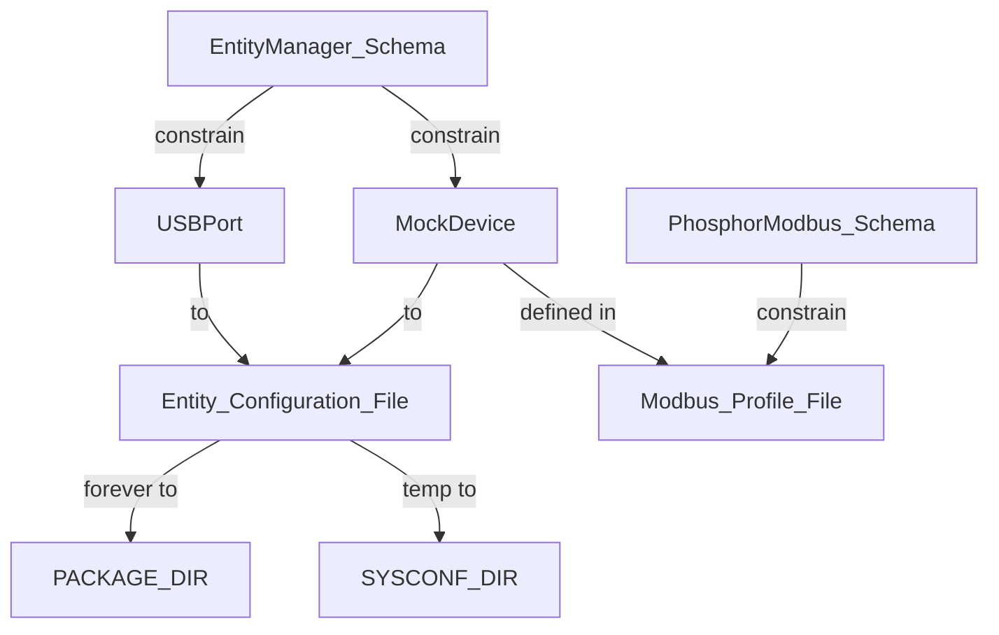

# Process

## 1 From recipes to openbmc

### revise kernel device tree to support uart

### configure the openbmc to support new hardware

### build a needed service into image

1.find recipes file *.bb

take _entity manager_ for example

`bitbake-layers show-recipes | grep -i entity`

note : the name correspond to *.bb's name

2.build alone to test is ok

`bitbake entity-manager`

3.add to imgae in /conf/local.conf

`IMAGE_INSTALL:append = " entity-manager"`

4.build 

`bitbake obmc-phosphor-image`

5.check service status (name found in [find services in open bmc](#find-services-in-openbmc))

`systemctl status <service name>`

6.check log

`journalctl -u <service name> --no-pager`

### find services in openbmc 

`ls -l /etc/systemd/system/multi-user.target.wants`

### start an env on host machine

open venv `conda activate openbmc`

`source oe-init-build-env`

`runqemu evb-ast2600 nographic slirp`

### service exec file in openbmc

ls /usr/libexec/

### add configuration into image

put configuarion in the source repo corresponding to the schemas.

## 2 Use openbmc to develop business

## A phosphor-modbus

### the use of phosphor-modbus on qemu

1.install dependencies on openbmc

this can find in service file

2.check the service whether starting or not  

3.install needed (also the same install process [ref](#build-a-needed-service-into-image))

4.copy needed file to qemu

needed file to be found at the source repo or something else

example for create file or remote operation on qemu

`ssh -p 2222 root@127.0.0.1 \
  'mkdir -p /usr/local/bin && chmod 755 /usr/local/bin'`

example for scp files

`scp -P 2222 \
  openbmc/phosphor-modbus/mocked_test_device/start_mock_server.sh \
  root@127.0.0.1:/usr/local/bin/start_mock_server.sh`

5.start script of mock server

6.ssh this qemu in other terminal

check the log to see whether service starts successfully, but it doesn't represent the happening of Modbus communication, must have entity manager configruation of USBPort and Modbus device.

`ls -l /dev/ttyUSB* /dev/ttyV*`
`ls -l /dev/serial/by-path/`

check entity manager whether publish USBPort and Modbus configuration

`busctl tree xyz.openbmc_project.EntityManager`

7.EntityManager doesn't publish USBPort

[add configuration into image](#add-configuration-into-image)

### only use openbmc service

## B entity manager

### how to publish usbport forever / temp

[add configuration into image](#add-configuration-into-image)

then use the repo tool to generate meson.build:

`/scripts/generate_config_list.sh`

**tmp :** 

put configuration in /etc/entity-manager/configurations

after execute start_mock_server.sh 1, need to add a configuration file according to schema usb_port.json.

this command may be helpful after execting script:

`ls -l /dev/serial/by-path/`

`systemctl restart xyz.openbmc_project.EntityManager.service`

`busctl tree xyz.openbmc_project.EntityManager`

### configuration dir in openbmc

PACKAGE_DIR : /usr/share/entity-manager/configurations : repo source configuration

PACKAGE_DIR : /usr/share/entity-manager/schema : repo source schema

SYSCONF_DIR : /etc/entity-manager/configurations : temp configuration

/var/configuration/system.json : entity-manager runtime configuration dir 

/tmp/configuration/last.json : last configuration or called cache , generated according to system.json

### add a mock device file under modbus profile

this profile need to follow schema

/usr/share/phosphor-modbus/profiles/name.json

name = Type field defined in entitymanager configuration file

### a process mock in qemu

### a problem 01 : always no load exposes

reason : the first time i configure a wrong configuration file , and when it runs loading to system.json, and cached to last.json, i only delete last.json, but need to delete system.json at the same time.

### a problem 02 : modbusrtu service start error

occured DeviceLocation do not match error.

from "1" in configuration file to number 1 in system.json.

reason : the binary version of phosphor-dbus-interface and phosphor-modbus doesn't match.

## 3 Revise Web app

# Master Level of OpenBMC

## Aug 25

- know how the entitymanager runs, but details of it still obscured.

- poor level of C++.