# Git 领域模型分析（DDD 视角）

> 分析对象：本仓库（Git 上古时代 ~v0.99 的 "stupid content tracker"）
> 分析方法：代码知识图谱（247 文件 / 1854 节点 / 14571 边 / 113 社区 / 213 执行流）+ 源码核实

---

## 1. 问题域与解决域

### 1.1 问题域（Problem Domain）

Git 要解决的核心问题：**高效地跟踪目录内容的变化**。

- **内容跟踪**：如何记录"一个目录在任何时刻的内容"——而不只是文件
- **版本历史**：如何表示变化的时序关系，支持回退、分支、合并
- **协作**：如何让多个开发者在同一项目上并行工作并整合成果
- **传输**：如何在不完整克隆（dumb 协议）或全量传输（smart 协议）间传递历史
- **完整性**：如何在传输/存储后校验数据未被破坏

约束：早期网络带宽有限（HTTP dumb 协议一次只拉一个对象）、无中央数据库、纯文件系统之上工作。

### 1.2 解决域（Solution Domain）

| 问题 | 解决方案 |
|---|---|
| 内容跟踪 | **内容寻址对象库**：blob（内容）/ tree（目录）/ commit（快照+父提交）/ tag（标签），SHA-1 即身份 |
| 版本历史 | **提交 DAG**：commit 之间 parent 边构成有向无环图，merge-base 计算合并基 |
| 暂存与提交 | **三层状态机**：工作区 → 索引（暂存区）→ 对象库 |
| 协作 | **引用（refs）** 标记分支/标签，CAS 锁文件更新，传输协议（fetch/push）协商 |
| 传输 | `git://`(pkt-line)、ssh、HTTP（dumb+协议头部）、local 四种通道 |
| 完整性 | SHA-1 校验、pack 索引（.idx）、fsck 对象检查 |

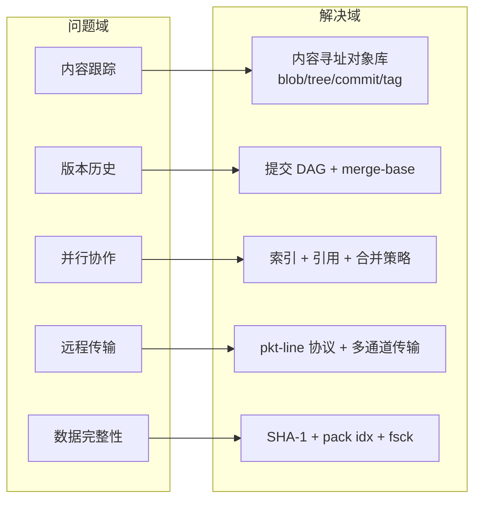

---

## 2. 领域模型、限界上下文、上下文映射

### 2.1 领域模型（核心概念与不变量）

Git 的领域是**内容跟踪 / 版本控制**，核心模型：

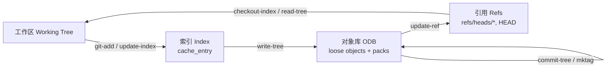

**核心不变量**：
- 对象**不可变**、按 SHA-1 内容寻址（同内容 = 同 ID）
- 提交历史构成 **DAG**（epoch.c / merge-base 保证合并基）
- ref 更新是 **CAS 语义**（`lock_ref_sha1(ref, old_sha1)` 校验旧值）
- 索引是暂存区快照，`cache_entry` 按路径名排序、二进制序列化

### 2.2 限界上下文（Bounded Contexts）

图谱社区检测（113 个社区）聚合为 **8 个限界上下文**：

| 限界上下文 | 核心文件 | 图谱社区 | 职责 |
|---|---|---|---|
| **对象存储 Object Store** | `sha1_file.c`, `sha1_name.c`, `object.c`, `pack-objects.c`, `index-pack.c` | git-sha1(62) | 对象读写、pack 打包/解包、对象解析 `get_sha1` |
| **索引 Index/Staging** | `read-cache.c`, `cache.h`, `update-index.c`, `ls-files.c` | git-ce(27) | 暂存区读/写/脏检查、路径冲突检测 |
| **版本图 Revision** | `commit.c`, `rev-list.c`, `rev-parse.c`, `name-rev.c`, `show-branch.c` | git-commit(41) | 提交图遍历、修订名解析、bisect |
| **Diff/补丁 Diff & Patch** | `diff.c`, `diffcore-*.c`, `apply.c`, `patch-id.c` | git-diff(57), git-gitdiff(75) | 差异计算、重命名检测、补丁套用 |
| **合并 Merge** | `git-merge-recursive.py`, `gitMergeCommon.py`, `merge-base.c`, `epoch.c`, `merge-index.c` | git-entry(39), git-debug(28) | 三方合并、重命名合并、合并基计算 |
| **传输 Transport** | `connect.c`, `fetch-pack.c`, `send-pack.c`, `http.c`, `http-fetch.c`, `http-push.c`, `receive-pack.c`, `upload-pack.c`, `daemon.c`, `ssh-*` | git-request(49), git-request-object(35), git-git(25), git-sockaddr(25) | git:///ssh/http 协议、ref 协商、对象传输 |
| **引用管理 Ref Mgmt** | `refs.c`, `update-ref.c`, `symbolic-ref.c`, `check-ref-format.c` | 散布 | ref 文件、CAS 锁、格式校验 |
| **仓库/配置 Repo & Config** | `init-db.c`, `config.c`, `environment.c`, `git.c`, `git-*.sh` | git-git-config(18) | 仓库初始化、配置读写、命令分发 |

### 2.3 上下文映射（Context Mapping）

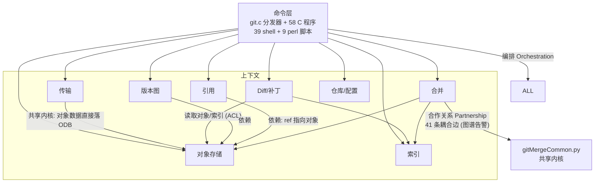

- **共享内核（Shared Kernel）**：`cache.h`（`cache_entry`/`active_cache` 全局态）、`object.h`、SHA-1 实现、`pkt-line`（协议报文）、`quote` — 全项目以 `#include "cache.h"` 强耦合。
- **合作关系（Partnership）**：`git-merge-recursive.py` ↔ `gitMergeCommon.py` 之间 41 条跨社区调用边，是图谱唯一告警点。
- **防腐层（ACL）**：Shell/Perl 脚本通过执行 `git-*` 命令（进程边界）访问 C 内核，天然形成隔离。

---

## 3. 实体、值对象、领域服务、领域事件

### 3.1 实体（Entities）— 有身份、可变

| 实体 | 身份标识 | 可变状态 | 位置 |
|---|---|---|---|
| **引用 Ref** | 路径名 `refs/heads/master` | 指向的 SHA-1（CAS 更新）、symbolic 目标 | `refs.c` |
| **索引条目 cache_entry** | 路径名 | staged/unmerged/racily-clean、stat 缓存 | `cache.h:73` |
| **HTTP 传输槽 active_slot** | 槽指针 | 状态机 idle/active/finished（异步回调） | `http.c` |
| **packed_git 句柄** | 包文件路径 | 缓存开关、mmap 状态 | `sha1_file.c` |
| **仓库 Repository** | `.git` 目录路径 | ODB/refs/index 的组合状态 | `init-db.c` |

### 3.2 值对象（Value Objects）— 不可变、内容寻址

- **对象：blob / tree / commit / tag**（`object.h:15`）— 最典型的值对象，内容即身份（SHA-1）
- **SHA-1 哈希** — 40 位十六进制，全项目传递
- **文件模式 + stat 信息** — `ce_match_stat_basic` 用于脏判断
- **diff_filespec** — diff 输入描述（`diff.c`）
- **补丁片段 fragment/patch** — `apply.c` 函数式解析的不可变结构（`gitdiff_oldname/gitdiff_newname` 等 30+ 个解析函数）
- **refspec**（`src:dst`）、**ident**（作者/提交者）、**日期/时区**（`date.c`）

### 3.3 领域服务（Domain Services）— 无状态处理器

| 服务 | 关键函数 | 关键度 |
|---|---|---|
| 对象存储服务 | `read_object_with_reference`(0.41), `sha1_object_info`(0.41), `has_sha1_pack`(0.41), `write_sha1_to_fd`(0.42) | 高 |
| 索引服务 | `read_cache`(0.485), `write_cache`, `add_cache_entry` | 高 |
| Diff 服务 | `diff_flush`(0.41), `builtin_diff`, `oneway_merge`(0.42), `twoway_merge`(0.41) | 高 |
| 修订解析服务 | `get_sha1`(0.40), `pop_most_recent_commit`(0.39) | 中 |
| 传输服务 | `git_connect`(0.61), `get_remote_heads`(0.61), `fetch_ref`(0.62), `match_refs`(0.62) | 最高 |
| HTTP 槽服务 | `get_active_slot`(0.62), `finish_all_active_slots`(0.63), `http_cleanup`(0.63) | 最高 |
| 引用服务 | `lock_ref_sha1`, `write_ref_sha1`, `for_each_ref` | 中 |
| 合并服务 | `buildGraph`(0.455), `mergeTrees`, `mergeFile`, `processRenames` | 中 |
| 配置服务 | `git_config_set`(0.41), `git_config_set_multivar` | 中 |

### 3.4 领域事件（Domain Events）— 隐式，无事件总线

无显式 pub/sub，全部是副作用隐式事件：

| 事件 | 触发 | 消费方 |
|---|---|---|
| 对象写入 | 任意对象落盘 | `update-server-info`（HTTP 元数据刷新，关键度 0.40） |
| ref 更新 | `update-ref` / `write_ref_sha1` | 写 ref 文件（本版本无 reflog） |
| commit 创建 | `commit-tree` | 版本图遍历 `rev-list` |
| fetch/push 完成 | 传输结束 | `update_server_info` 重建 info/refs |
| 合并冲突 | 合并产生 unmerged 条目 | `ls-files -u` / 用户手工解决 |
| HTTP 响应到达 | 槽回调 | `process_response`(0.62) |
| ack 收到 | fetch 协商 | `get_ack` |

---

## 4. 存储（Persistence）

| 数据 | 存储 | 格式 |
|---|---|---|
| 对象 | `.git/objects/xx/xxxx…` | zlib 压缩（松散）；`.pack` + `.idx`（delta 压缩包） |
| 引用 | `.git/refs/**` + `.git/HEAD` | 40 位 SHA-1 文本文件；lock 文件做 CAS |
| 索引 | `.git/index` | 二进制：`cache_header` + 排序的 `cache_entry` |
| 配置 | `.git/config` | key=value 文本 |
| HTTP 元数据 | `.git/info/refs`, `.git/info/packs` | `update-server-info` 生成 |

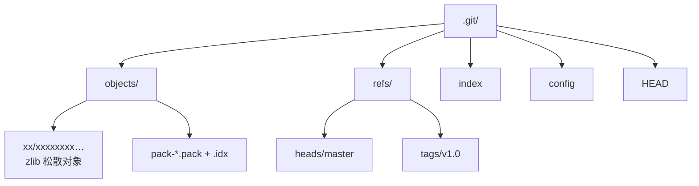

**设计要点**：
- 对象**只追加、不修改**（不可变）；删除靠 `prune`/`fsck` 标记
- ref 更新 = 写锁文件 + rename（原子性）
- 索引整体重写（`write_cache`），无增量
- 对象可能以松散或 pack 两种形态存在 → `pack-objects` / `index-pack` 是形态转换器

---

## 5. 聚合关系与模块组织

### 5.1 聚合（Aggregates）

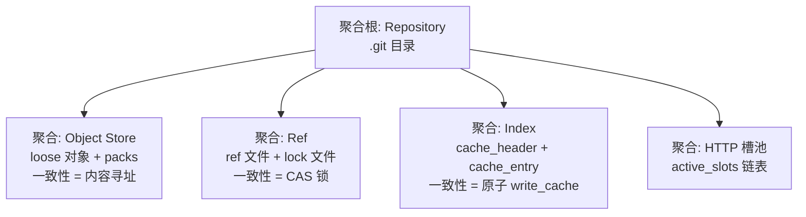

> 实现是**事务脚本风格**（无 DDD 聚合根对象，全局态 `active_cache`/`objs` 数组），但一致性边界清晰：对象存储靠内容寻址、refs 靠锁文件、索引靠整块序列化。

### 5.2 模块组织（Makefile 视角）

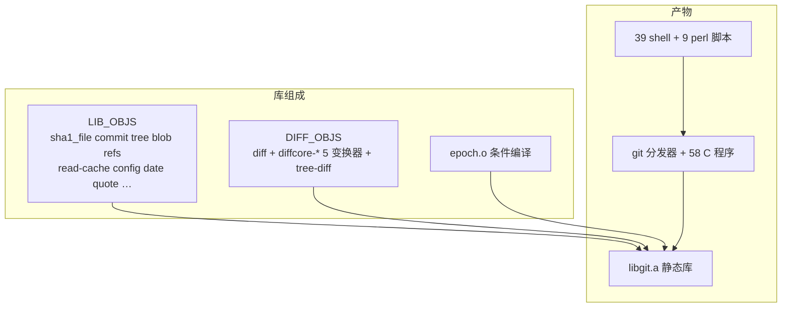

- **LIB_OBJS**：基础领域库（对象、索引、引用、配置、工具）
- **DIFF_OBJS**：diff 引擎与 diffcore 变换器（break/order/pathspec/pickaxe/rename），独立模块
- **LIB_H**：`cache.h` 为最大共享头（含 `cache_entry` 与全局声明）
- 各命令 = 薄 `main` + 库调用（"一命令一文件"）

---

## 6. 接口的设计思想

### 6.1 命令接口（进程边界 = API 边界）

- 每个子命令是独立可执行程序（`git-apply`、`git-commit-tree`…），`git.c` 按 `git-*` 前缀在 exec 路径中查找并 `execvp` 分发
- Shell/Perl 脚本通过**子进程调用** C 程序组合功能（组合式 CLI，类 Unix 工具哲学）

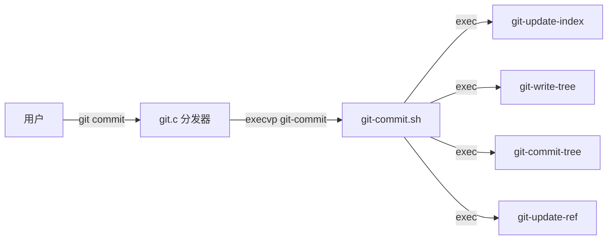

### 6.2 库接口（C API 风格）

- **函数指针回调遍历**：`for_each_ref(fn, …)` / `head_ref(fn, …)` / `object_list` 遍历 —— 数据驱动、调用方注入行为
- **两步式 CAS 接口**：`lock_ref_sha1(ref, old_sha1) → write_ref_sha1(ref, fd, new_sha1)`，把"校验+写入"显式拆分，杜绝竞态
- **统一解析入口**：`get_sha1()` 一条 API 消化所有修订语法（SHA-1、ref、`HEAD^`、`~N`、`:/regex`…）
- **全局状态 + 显式初始化**：`active_cache` / `objs` 等全局数组 + `read_cache()` 惰性加载（早期无并发，简单直接）

### 6.3 协议接口（wire protocol）

- **pkt-line**：长度前缀报文（`packet_write` / `packet_read_line` / `packet_flush`），"silly packetized line writing interface"，多路复用于 ref 协商与对象传输
- **dumb 协议**：纯 HTTP GET 拉取对象（一次一个），无状态、可被任意静态服务器服务
- **smart 协议**：upload-pack / receive-pack 对谈（ref 广告 → want/have → ack）

### 6.4 变换器管线（pipeline）设计

**diffcore**：将 diff 分解为可组合变换器，`diffcore_std()` 统一编排：

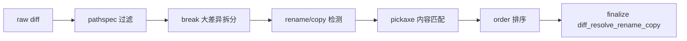

**合并策略插件化**：`git-merge.sh` 声明策略集 `'recursive octopus resolve stupid ours'`（默认 `recursive`），按分支数自动选择——策略即插即用的命令分发（同构于接口多态）。

### 6.5 设计思想小结

| 思想 | 体现 |
|---|---|
| 组合优于继承 | 命令 = 库函数组合；diffcore 变换器链 |
| 内容寻址 | 值对象不可变，身份=内容，天然去重/缓存/校验 |
| 进程隔离 | 脚本/命令间仅通过参数与退出码契约 |
| 回调注入 | 遍历 API 用函数指针，库不感知调用方数据结构 |
| 显式事务 | 锁文件 + CAS + rename，无隐式事务抽象 |
| 最小惊讶 | `packet_flush` 等自嘲式命名反映"愚蠢但极快"哲学 |

---

## 7. 业务流程与入口

### 7.1 总量统计

| 入口类型 | 数量 | 说明 |
|---|---|---|
| C 可执行程序（`main()`） | **58** | 命令、守护进程、协议服务端、辅助工具，每文件一个 `main` |
| Shell 脚本（`SCRIPT_SH`） | **39** | 高层/组合式命令 |
| Perl 脚本（`SCRIPT_PERL`） | **9** | 导入导出、邮件、移动等 |
| Python 脚本 | **1** | `git-merge-recursive.py`（+ `gitMergeCommon.py` 库） |
| **命令入口合计** | **107** | 即 107 个可执行业务流程入口 |
| 统一分发器 | 1 | `git.c:232` 的 `main`，按 `git-*` 前缀 execvp 分发 |
| 图谱检测执行流 | **213** | 含内部子流程（`fetch`/`prefetch`、HTTP 槽回调、`main` 内部扇出等） |

> 每个 C 命令 = 薄 `main` + libgit.a 调用；每个脚本 = 子进程调用若干 C 命令的组合编排。因此**业务流程 ≈ 命令入口**，213 条执行流是图谱在调用图层面细化的结果。

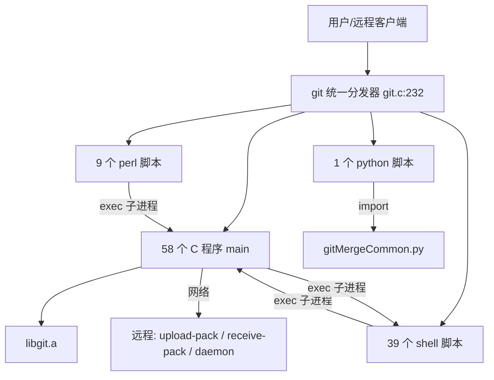

### 7.2 C 程序入口清单（58 个，按域分组）

| 业务域 | 命令 | 入口（文件 : `main()` 行号） |
|---|---|---|
| 仓库初始化 | `git-init-db` | `init-db.c:231` |
| 对象管理 | `git-hash-object` | `hash-object.c:35` |
| | `git-cat-file` | `cat-file.c:8` |
| | `git-mktag` | `mktag.c:105` |
| | `git-fsck-objects` | `fsck-objects.c:430` |
| | `git-pack-objects` | `pack-objects.c:468` |
| | `git-unpack-objects` | `unpack-objects.c:265` |
| | `git-index-pack` | `index-pack.c:411` |
| | `git-verify-pack` | `verify-pack.c:32` |
| | `git-show-index` | `show-index.c:3` |
| | `git-pack-redundant` | `pack-redundant.c:595` |
| | `git-prune-packed` | `prune-packed.c:57` |
| | `git-convert-objects` | `convert-objects.c:315` |
| | `git-unpack-file` | `unpack-file.c:25` |
| | `git-get-tar-commit-id` | `get-tar-commit-id.c:10` |
| 索引/暂存 | `git-update-index` | `update-index.c:423` |
| | `git-read-tree` | `read-tree.c:626` |
| | `git-write-tree` | `write-tree.c:88` |
| | `git-ls-files` | `ls-files.c:567` |
| | `git-checkout-index` | `checkout-index.c:112` |
| 版本图/历史 | `git-rev-list` | `rev-list.c:722` |
| | `git-rev-parse` | `rev-parse.c:150` |
| | `git-show-branch` | `show-branch.c:460` |
| | `git-name-rev` | `name-rev.c:122` |
| | `git-merge-base` | `merge-base.c:234` |
| Diff/补丁 | `git-diff-files` | `diff-files.c:35` |
| | `git-diff-index` | `diff-index.c:171` |
| | `git-diff-tree` | `diff-tree.c:163` |
| | `git-diff-stages` | `diff-stages.c:54` |
| | `git-apply` | `apply.c:1780` |
| | `git-patch-id` | `patch-id.c:75` |
| | `git-tar-tree` | `tar-tree.c:401` |
| 合并 | `git-merge-index` | `merge-index.c:98` |
| 传输（拉） | `git-fetch-pack` | `fetch-pack.c:400` |
| | `git-local-fetch` | `local-fetch.c:205` |
| | `git-ssh-fetch` | `ssh-fetch.c:124` |
| | `git-http-fetch` | `http-fetch.c:918` |
| | `git-peek-remote` | `peek-remote.c:24` |
| 传输（推） | `git-send-pack` | `send-pack.c:282` |
| | `git-ssh-upload` | `ssh-upload.c:112` |
| | `git-http-push` | `http-push.c:1221` |
| 传输（服务端） | `git-upload-pack` | `upload-pack.c:249` |
| | `git-receive-pack` | `receive-pack.c:248` |
| | `git-daemon` | `daemon.c:595` |
| | `git-shell` | `shell.c:27` |
| | `git-clone-pack` | `clone-pack.c:142` |
| | `git-update-server-info` | `update-server-info.c:6` |
| 引用管理 | `git-update-ref` | `update-ref.c:19` |
| | `git-symbolic-ref` | `symbolic-ref.c:20` |
| | `git-check-ref-format` | `check-ref-format.c:10` |
| 配置/仓库 | `git-repo-config` | `repo-config.c:73` |
| | `git-var` | `var.c:54` |
| 辅助工具 | `git-mailinfo` | `mailinfo.c:749` |
| | `git-mailsplit` | `mailsplit.c:106` |
| | `git-stripspace` | `stripspace.c:27` |
| 分发器 | `git` | `git.c:232` |

### 7.3 脚本类入口清单（49 个）

**Shell 脚本（39 个）**——入口即脚本本身（`#!/bin/sh`），常见流程编排：

| 业务域 | 命令 |
|---|---|
| 高层工作流 | `git-add.sh` `git-commit.sh` `git-checkout.sh` `git-reset.sh` `git-status.sh` `git-log.sh` `git-whatchanged.sh` `git-cherry.sh` |
| 分支/标签 | `git-branch.sh` `git-tag.sh` `git-verify-tag.sh` |
| 合并/变基 | `git-merge.sh` `git-merge-one-file.sh` `git-merge-octopus.sh` `git-merge-resolve.sh` `git-merge-stupid.sh` `git-merge-ours.sh` `git-resolve.sh` `git-rebase.sh` `git-revert.sh` `git-am.sh` `git-applymbox.sh` `git-applypatch.sh` |
| 传输 | `git-clone.sh` `git-fetch.sh` `git-pull.sh` `git-push.sh` `git-ls-remote.sh` `git-request-pull.sh` |
| 对象维护 | `git-prune.sh` `git-repack.sh` `git-count-objects.sh` `git-lost-found.sh` |
| 补丁/搜索 | `git-format-patch.sh` `git-grep.sh` `git-diff.sh` |
| 基础设施 | `git-sh-setup.sh` `git-parse-remote.sh` |

**Perl 脚本（9 个）**：`git-archimport.perl` `git-cvsimport.perl` `git-cvsexportcommit.perl` `git-svnimport.perl`（导入）；`git-send-email.perl`（邮件）；`git-mv.perl`（移动）；`git-shortlog.perl`（日志统计）；`git-relink.perl`（硬链接去重）；`git-fmt-merge-msg.perl`（合并消息生成）

**Python 脚本（1 个）**：`git-merge-recursive.py`（递归三方合并策略，`buildGraph`/`mergeTrees` 为核心流程）

### 7.4 代表性流程的完整入口链

**提交流程**（用户视角的端到端示例）：

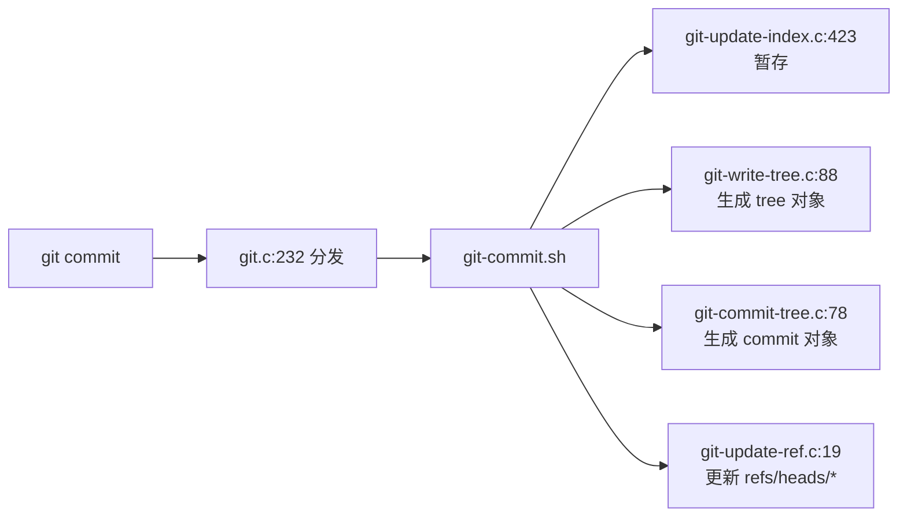

**拉取流程**（图谱关键度最高 0.64）：

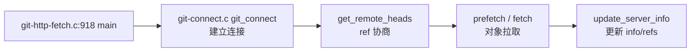

---

*文档基于 code-review-graph 图谱（built_at_sha `c2f3bf0`，与 HEAD 一致）与源码交叉核实生成。*
