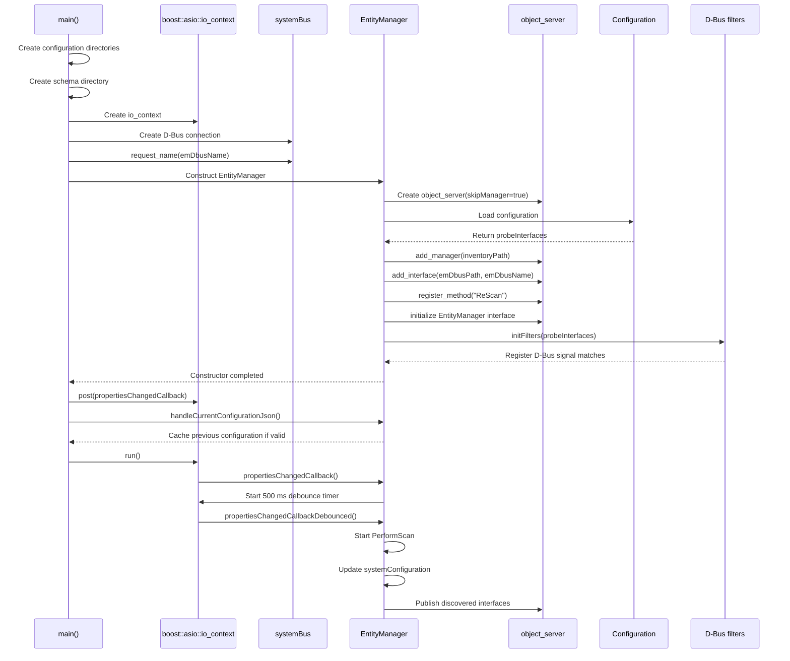
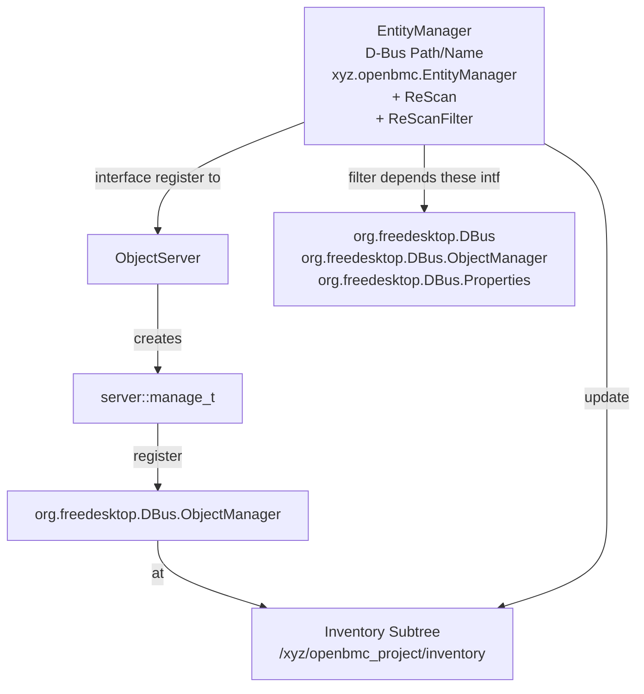
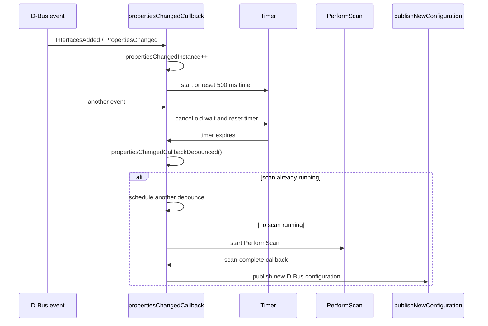

# main

## surface model

## domain model

EntityManager Work Model...

# EntityManager :: EntityManager

## surface model

1. register /xyz/openbmc_project/inventory in object server to manage inventory subtree.

2. regitster entity manager dbus path : /xyz/openbmc_project/EntityManager and its dbus name : xyz.openbmc_project.EntityManager in object server.

3. register ReScan method under the em interface.

4. register ReScan method to D-Bus.

5. register interface filter to trigger ReScan.

## domain model

# EntityManager::propertiesChangedCallback()
# EntityManager::propertiesChangedCallbackDebounced()

## surface model

## domain model

Listener Model inside EntityManager...