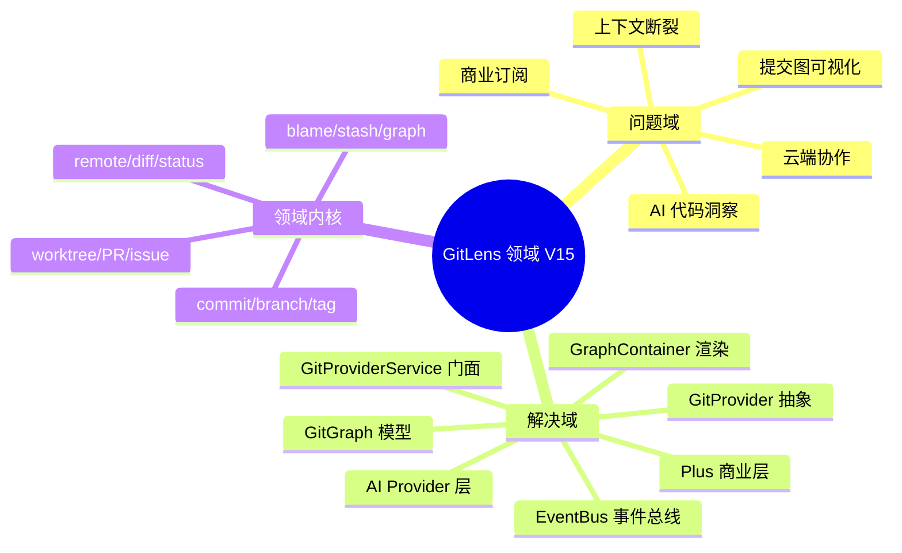
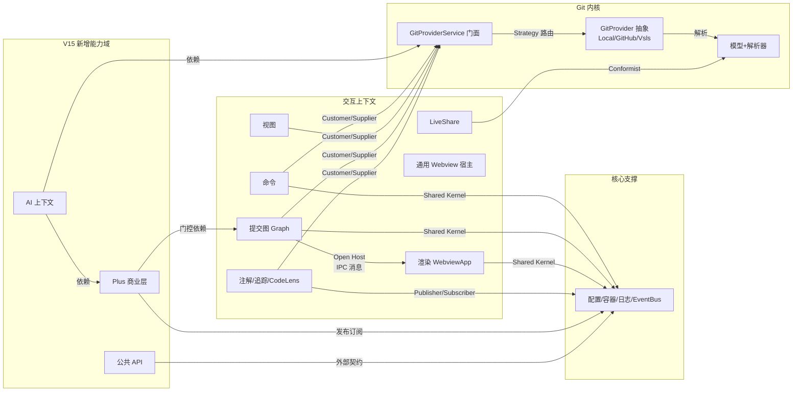
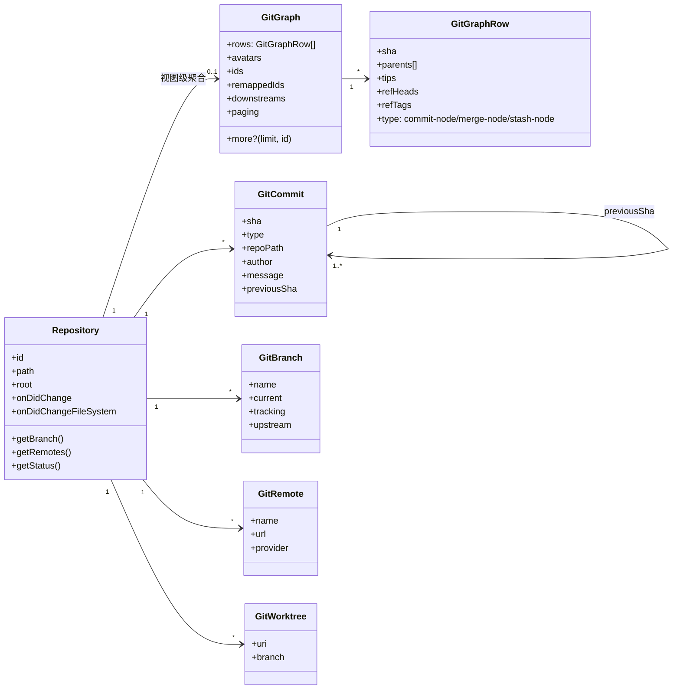
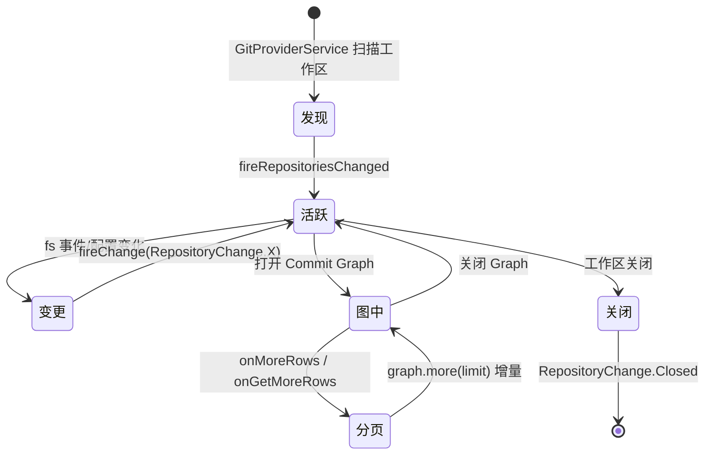
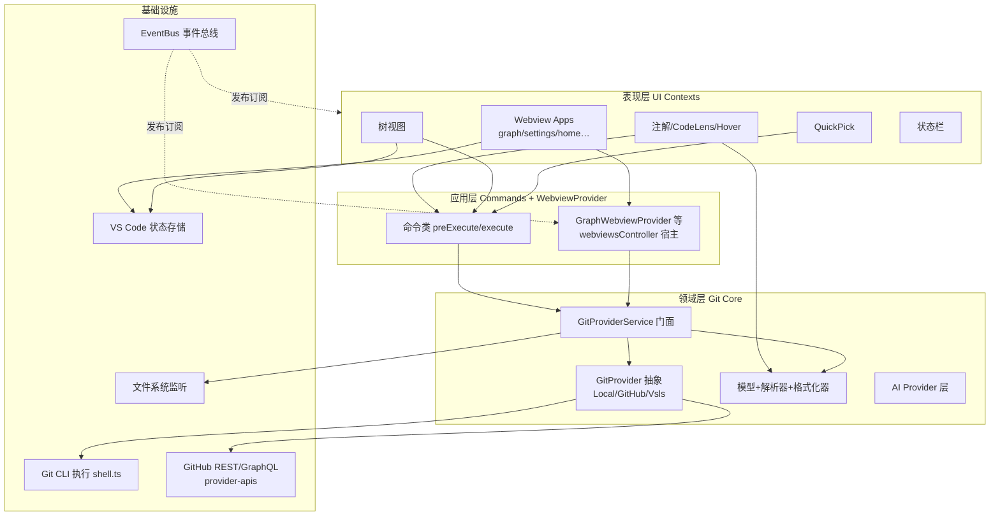
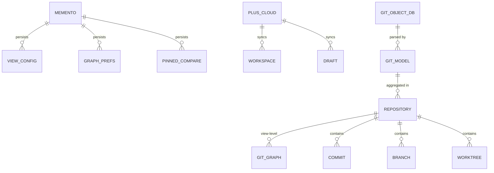
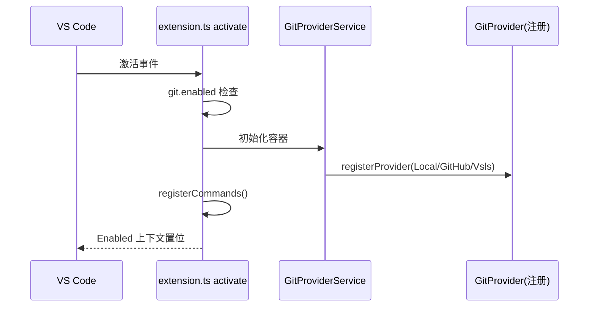
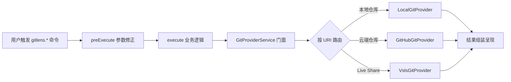
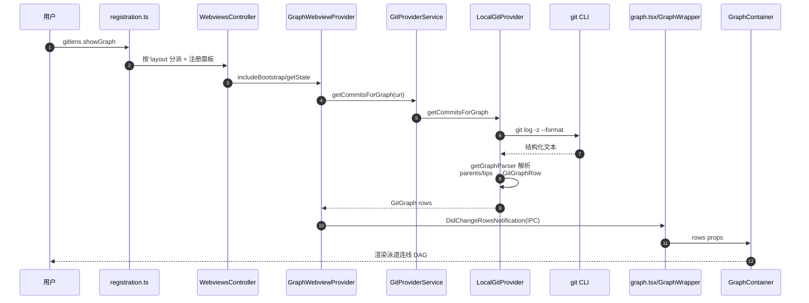
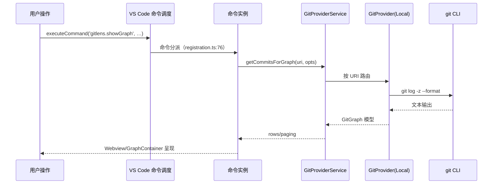

# vscode-gitlens 领域分析文档（DDD）· V10→V15 演进版

> **双基线依据**：code-review-graph 知识图谱 × 2 ＋ 源码走读
> - V10 基线（历史）：`vscode-gitlens` @ `861f641`（tag `v10.0.0`）— 图谱 240 文件 / 2,884 节点 / 14,748 边 / 493 执行流程 / 17 社区
> - V15 现状（当前）：`gitlens-v15/vscode-gitlens` @ `20a8cf2`（tag `v15.0.0`）— 图谱 613 文件 / 10,224 节点 / 58,251 边 / 1,670 执行流程 / 28 社区
> 阅读约定：以 **V15 为现状主体**，以 **V10 为演进基线**，逐章给出「V10 → V15」对比与演进结论；术语首次出现附英文原文。
> 生成时间：2026-08-28 ｜ 语言：中文

---

## 1. 领域概览

### 1.1 问题域（Problem Domain）

GitLens 要解决的核心业务问题（V10→V15 未变）：**在 VS Code 编辑器中，让开发者"零切换"地获得 Git 代码洞察**——就地回答"这行是谁写的、为什么改、何时改、与谁相关、怎么演进"。

| 维度 | V10 | V15（问题域扩展） |
|---|---|---|
| 核心痛点 | 传统 Git 工作流需频繁切换终端/浏览器，上下文断裂 | 同左 + **提交图可视化**（一眼看懂分支拓扑）、**AI 代码洞察**（解释代码/生成提交信息）、**云端工作区/草稿**协作 |
| 业务约束 | 实时、可配置（60+ 设置项）、跨远程 | 同左，新增 **Plus 商业能力**（订阅门控）、**多 Provider 可插拔**（git/github/vsls）、**公共 API 开放** |
| 领域对象 | commit、branch、blame、stash、tag、remote、diff、status、reflog | 同左 + **graph**、worktree、pullRequest、issue、merge/rebase status、patch、shortlog、user（`src/git/models/` 19 → 30 文件） |

### 1.2 解决域（Solution Domain）

**V10 方案**：`GitService` 单体门面（`src/git/gitService.ts:166`，2,959 行）封装全部 git 命令 + 领域模型层 + 多形态 UI + 事件驱动追踪器。

**V15 演进**：从「单体门面」走向「**插件化 Provider 抽象 + 门面服务 + App 化 Webview**」：

1. **Provider 抽象**（核心架构升级）：`GitProvider` 接口（`src/git/gitProvider.ts`，`GitProviderId = 'git' | 'github' | 'vsls'`）→ 实现 `LocalGitProvider`（`src/env/node/git/localGitProvider.ts:238`，5,888 行）/ `GitHubGitProvider` / `VslsGitProvider`；统一由 `GitProviderService` 门面（`src/git/gitProviderService.ts:119`，2,809 行）按仓库 URI 分发
2. **提交图（Commit Graph）**：`git log -z --format` 结构化协议 → `getGraphParser` → `GitGraphRow` → 经 IPC 推给前端 `GraphContainer`（`@gitkraken/gitkraken-components@10.3.0`，GitKraken 自研渲染组件）——V10 无此能力
3. **领域模型层**：`src/git/models/`（30 文件）+ `src/git/parsers/` 一一对应
4. **多形态交互**：注解/CodeLens/Hover/树视图/QuickPick 保留，Webview 体系膨胀为多 App（graph/home/settings/rebase/commitDetails/timeline…）
5. **新增能力域**：`src/ai/`（AI Provider：anthropic/gemini/openai）、`src/plus/`（商业层：drafts/focus/workspaces/gk/integrations）、`src/api/`（公共 API `gitlens.d.ts`）、`src/eventBus.ts`（全局事件总线）



---

## 2. 战略设计（Strategic Design）

### 2.1 限界上下文（Bounded Context）

**V10**（17 社区 → 10 上下文）：Git 内核、命令、视图、QuickPick、注解、追踪、CodeLens、Webview、LiveShare、核心支撑。

**V15**（28 社区 → 归并 12 个核心上下文）。社区规模前 6：`graph-provider`（1,625 节点）、`components-render`（1,417）、`nodes-node`（1,257）、`models-git`（1,169）、`commands-command`（916）、`system-constructor`（581）。

| # | 限界上下文 | 核心语言（Ubiquitous Language） | 主要代码（证据） |
|---|---|---|---|
| 1 | **Git 内核上下文**（Git Core） | commit、sha、blame、branch、graph、remote、ref | `src/git/`（gitProvider.ts / gitProviderService.ts / git.ts / models/ / parsers/） |
| 2 | **命令上下文**（Commands） | 命令、preExecute、execute、args、*CommandArgs | `src/commands/`（60+ 命令类） |
| 3 | **视图上下文**（Views） | 树节点 ViewNode、treeItem、getChildren、viewCommands | `src/views/`（nodes/ 30+ 节点类型 + `registerViewCommand` degree 312） |
| 4 | **提交图上下文**（Graph，V15 新增，最大社区） | graph、rows、GitGraphRow、refGroups、paging、onMoreRows | `src/plus/webviews/graph/`（graphWebview.ts:195，3,145 行）＋ `src/git/models/graph.ts` |
| 5 | **渲染上下文**（Render，V15 新增） | GraphContainer、WebviewApp、React、setState | `src/webviews/apps/plus/graph/`（graph.tsx、GraphWrapper.tsx:1439） |
| 6 | **Plus 商业上下文**（Plus，V15 新增） | drafts、focus、workspaces、gk、integration、subscription | `src/plus/`（drafts/ focus/ workspaces/ gk/ integrations/） |
| 7 | **AI 上下文**（AI，V15 新增） | aiProvider、model、explain、generateMessage | `src/ai/`（aiProviderService.ts + anthropic/gemini/openai） |
| 8 | **API 上下文**（API，V15 新增） | actionRunner、registerActionRunner、public API | `src/api/`（api.ts、actionRunners.ts、gitlens.d.ts） |
| 9 | **注解/追踪/CodeLens 上下文** | blame、heatmap、line tracker、dirty state | `src/annotations/`、`src/trackers/`、`src/codelens/` |
| 10 | **Webview 上下文**（通用） | webviewPanel、instance、protocol 消息、registerWebviewCommand | `src/webviews/`（webviewsController.ts:104、webviewCommandRegistrar.ts） |
| 11 | **协作上下文**（Live Share） | vsls、host、guest、request | `src/vsls/` |
| 12 | **核心支撑上下文**（Core） | config、container、logger、eventBus、decorators | `src/container.ts`（degree 462）、`src/system/`、`src/eventBus.ts:71` |

> **演进结论**：V10 的「Webview 上下文」在 V15 分裂为「提交图 + 渲染 + 通用 Webview 宿主」三个上下文——这是 commit graph 能力落地的直接体现；同时新增 AI / Plus / API 三个能力域，GitLens 从"Git 洞察工具"演进为"Git 工作台平台"。

### 2.2 上下文映射（Context Map）

基于图谱跨社区耦合边（CALLS/REFERENCES）判定合作关系：



| 关系类型 | 参与方 | 证据（图谱耦合边） |
|---|---|---|
| Customer/Supplier | 命令/视图/图/注解 → Git 内核 | V10：commands→git **272**（直连）；V15：commands→models-git **751**、src-view→models-git **194**、graph-provider→models-git（经 `getCommitsForGraph`）——**均改经 `GitProviderService` 门面转发**（degree 385） |
| Strategy 路由 | GitProviderService → Provider 实现 | `gitProviderService.ts:210` `_providers = Map<GitProviderId, GitProvider>`、`:402-404` `registerProvider` |
| Open Host Service | 提交图 ↔ 渲染 | `graphWebview.ts:1468` `notifyDidChangeRows` 推送 `DidChangeRowsNotification`，`graph.tsx:189` 消费 |
| Shared Kernel | 各上下文 ↔ 核心支撑 | graph-provider→system-constructor **751**、git-git→system-constructor **349**（共享 Container/Configuration/Logger） |
| Publisher/Subscriber | 仓库/追踪 → 各视图 | `gitProviderService.ts:144-146` `onDidChangeRepositories`（V15 带 `added/removed/etag`） |
| 门控依赖 | Plus 商业层 → 提交图 | `getGraphAccess`（Plus 订阅权限校验，`graphWebview.ts:1972`） |
| Conformist | Live Share → Git 模型 | `src/vsls/` 复用 GitCommit/GitUri 模型 |

> ⚠️ V10 风险缓解验证：V10 中「Git 内核被 5 个上下文直接消费且无防腐层，272 条命令→git 直连」——V15 通过 `GitProviderService` 门面将**所有** Git 访问收敛为单点（degree 385 热点），命令侧不再直接触碰 Provider 实现；但代价是门面本身成为巨型依赖枢纽（见 §4.3 依赖倒置残余）。

---

## 3. 战术设计（Tactical Design）

### 3.1 实体（Entity）

V10 的 10 个实体在 V15 全部保留；`src/git/models/` 从 19 文件扩至 30 文件，**新增 8 个实体**（graph、worktree、pullRequest、issue、merge、rebase、patch、shortlog、user、defaultBranch 等）。

| 实体 | 身份标识（id） | 关键属性 | 证据 |
|---|---|---|---|
| `GitCommit` | `sha` | type、repoPath、author、message、previousSha | `src/git/models/commit.ts`（degree 264 热点） |
| `GitLogCommit` | 继承 sha | +fileNames、stats、parents | `src/git/models/logCommit.ts` |
| `GitStashCommit` | 继承 sha | +stashName | `src/git/models/stashCommit.ts` |
| `GitBlameCommit` | 继承 sha | +lineCount、lines | `src/git/models/blameCommit.ts` |
| `GitBranch` | 名称 + 仓库 | current、remote、tracking、starred、upstream | `src/git/models/branch.ts` |
| `GitTag` | 名称 + 仓库 | commitSha、date | `src/git/models/tag.ts` |
| `Repository` | `id`（组合 folder+path） | folder、path、root、index、supportsChangeEvents | `src/git/models/repository.ts`（degree 493 热点，`RepositoryChange` 枚举 `:63`） |
| `GitRemote` | 名称 + url | provider、url、domain | `src/git/models/remote.ts` |
| `GitReflogRecord` | 记录序号 | command、message、sha | `src/git/models/reflog.ts` |
| `GitContributor` | 邮箱/名称 | name、email、count、commits | `src/git/models/contributor.ts` |
| **`GitGraph`**（V15 新增） | 仓库 + 分页游标 | rows、avatars、ids、remappedIds、downstreams、paging、`more?(limit,id)` | `src/git/models/graph.ts:46-63` |
| **`GitGraphRow`**（V15 新增） | sha | parents、tips、refHeads/refTags、type（commit/merge/stash node） | `src/git/models/graph.ts` |
| **`GitWorktree`**（V15 新增） | 路径 | uri、locked、readOnly、branch | `src/git/models/worktree.ts` |
| **`GitPullRequest`/`GitIssue`**（V15 新增） | provider+id | url、title、state、repo | `src/git/models/pullRequest.ts`、`issue.ts` |
| **`GitMergeStatus`/`GitRebaseStatus`**（V15 新增） | 仓库 | merge/rebase 进行中状态、冲突文件 | `src/git/models/merge.ts`、`rebase.ts` |

### 3.2 值对象（Value Object）

| 值对象 | 特征（不可变/按值相等） | 证据 |
|---|---|---|
| `GitUri` | 封装 repoPath、sha、versionedPath 的不可变 Uri 扩展 | `src/git/gitUri.ts`（V10 degree=109，全项目最广使用 VO） |
| `GitAuthor` | name + email + 时间戳（V15 独立成文件） | `src/git/models/author.ts` |
| `GitFile` / `GitFileWithCommit` | path、originalPath、status、additions/deletions | `src/git/models/file.ts` |
| `GitDiffHunk` / `GitDiffLine` | 差异块行信息 | `src/git/models/diff.ts` |
| `GitTrackingState` | ahead/behind 跟踪状态 | `src/git/models/branch.ts` |
| `GitStatusFile` | 工作区文件状态 | `src/git/models/status.ts` |
| `GitReference` | 引用抽象（refType: revision/branch/tag；V15 独立成文件） | `src/git/models/reference.ts` |
| **`GitGraphRow` 组成件**（V15 新增） | parents[]（图的边）、tips[]（ref 徽章数据） | `src/git/models/graph.ts` |

### 3.3 领域服务（Domain Service）

**核心演进：V10 `GitService` 单体（2,959 行）→ V15 Provider 插件化 + 门面。**

| 领域服务 | 职责 | 证据 |
|---|---|---|
| `GitProviderService`（V15 门面） | 按仓库 URI 路由到具体 Provider；统一暴露 `getCommitsForGraph/getBlameForLine/getLogForFile/...`；维护 `_providers: Map<GitProviderId, GitProvider>` 与仓库生命周期 | `src/git/gitProviderService.ts:119`（2,809 行，degree 385） |
| `GitProvider`（V15 抽象契约） | 定义 Provider 需实现的全部 Git 能力（descriptor/supportedSchemes/discoverRepositories/getCommit/getBlameForLine/getCommitsForGraph…） | `src/git/gitProvider.ts`（`GitProviderId = 'git'\|'github'\|'vsls'`） |
| `LocalGitProvider`（V15 实现） | 本地 git CLI 全量实现：getCommitsForGraph（`:2295`）、getBlameForLine（`:1897`）、getLogForFile（`:3702`）、logStreamTo（`:2378`） | `src/env/node/git/localGitProvider.ts:238`（5,888 行） |
| `GitHubGitProvider`（V15 实现） | 云端仓库（github.dev/远程 repo）实现，经 GitHub REST/GraphQL API | `src/env/node/git/github/`（3,517 行） |
| `VslsGitProvider`（V15 实现） | Live Share 会话中的远端 Git 能力 | `src/env/node/git/vslsGitProvider.ts` |
| `Git`（底层命令执行） | 组装 git 参数、解析退出码、执行 shell | `src/env/node/git/git.ts` |
| `GitParser` 系列 | git 文本输出 → 模型（blameParser/logParser/**getGraphParser** `logParser.ts:135` 等） | `src/git/parsers/` |
| `AiProviderService`（V15 新增） | AI 能力编排：Explain/Generate Commit Message/Generate Stash Message，Provider 可插拔（anthropic/gemini/openai） | `src/ai/aiProviderService.ts` + `src/ai/*Provider.ts` |
| `IntegrationService`（V15 新增） | 远程托管平台集成注册与调度（GitHub/GitLab/Bitbucket/Azure DevOps…） | `src/plus/integrations/integrationService.ts` |
| `Container` | 依赖容器（静态单例注册表，V15 degree 462 热点） | `src/container.ts:27` |
| `EventBus`（V15 新增） | 全局跨模块事件总线（订阅/发布解耦） | `src/eventBus.ts:71` |

### 3.4 领域事件（Domain Event）

| 事件 | 触发条件 | 消费者 | 证据 |
|---|---|---|---|
| `RepositoriesChanged`（V15 升级为 `RepositoriesChangeEvent`） | 仓库新增/删除/发现完成 | 各视图 `refresh()`、Graph webview | V10 `gitService.ts:516`；V15 `gitProviderService.ts:144-146,174`（**携带 `added/removed/etag`**） |
| `RepositoryChange`（Remotes/Stashes/Tags/Config/Closed…） | 仓库级变化（fs 监听 + 配置变化） | `Repository` 订阅者 | `repository.ts:212-214`、`RepositoryChange` 枚举 `:63` |
| `RepositoryFileSystemChange` | 工作区文件增删改 | 视图树刷新 | `repository.ts:217-219` |
| `LinesChange` | 光标/选区/可见行变化 | 注解 provider、CodeLens | `src/trackers/gitLineTracker.ts` |
| `BlameStateChange` / `DirtyStateChange` | blame 计算完成 / 脏状态变化 | 注解与 CodeLens 刷新 | `gitLineTracker.ts` |
| **`DidChangeRowsNotification`**（V15 新增） | Graph rows 数据就绪/增量 | 前端 GraphWrapper（IPC 消息） | `graphWebview.ts:1468`、`graph.tsx:189` |
| **跨模块事件总线事件**（V15 新增） | 订阅/账户/配置等全局变更 | 通过 `EventBus` 解耦的任意订阅方 | `src/eventBus.ts:71` |

### 3.5 聚合与聚合根（Aggregate / Aggregate Root）

**V15 保留 `Repository` 聚合根，新增 `GitGraph` 图聚合**（V15 核心业务单元）：



- **聚合根①** `Repository`（`repository.ts`，degree 493 热点）：持有 branch/tag/remote/status/worktree/commit 子实体，`onDidChange` 维护一致性，与 V10 相同
- **聚合根②** `GitGraph`（`graph.ts:46-63`）：提交图数据聚合——`rows` 是行级值对象集合，`remappedIds` 维护 stash 内部提交重映射的一致性，`paging` + `more()` 封装增量加载契约；其生命周期由 `GraphWebviewProvider` 管理（`graphWebview.ts`）
- **内部一致性规则**：`GitGraphRow.parents` 与 `GitCommit.previousSha` 双通道表达父子链；`remappedIds` 保证 stash 行不重复渲染内部提交；`GitBranch.upstream` 与 `GitTrackingState` 联动



---

## 4. 架构与组织

### 4.1 架构风格

**V10**：门面（Facade）＋ 分层（Layered）＋ 事件驱动（Event-Driven）。
**V15**：在 V10 基础上新增 **插件化（Plugin：Provider 抽象）＋ App 化（Webview 多应用宿主）＋ 事件总线（EventBus）**。



- **依赖方向**：表现层 → 命令/WebviewProvider 层 → 门面 → Provider 实现 → 基础设施（单向）
- **插件化**：新增 Git 能力一律实现 `GitProvider` 接口注册进 `GitProviderService`（`gitProviderService.ts:402` `registerProvider`），不再修改门面
- **App 化**：`WebviewsController`（`webviewsController.ts:104`）统一管理多实例 Webview 面板（`registerWebviewPanel` `:247`），`includeBootstrap` + 动态 import 懒加载（`graphWebview.ts:373`）

### 4.2 模块组织

**V15 目录**（相对 V10 主要新增 `plus/`、`ai/`、`api/`、`env/`、`eventBus.ts`）：

```
src/
├── extension.ts        # 激活入口
├── commands/           # 命令上下文（60+ 命令类）
├── git/                # Git 内核上下文
│   ├── gitProvider.ts      #   ★ Provider 抽象契约（V15 新增）
│   ├── gitProviderService.ts # ★ 门面（2,809 行）
│   ├── gitUri.ts           #   核心值对象
│   ├── models/             #   领域模型（30 文件，V10 19 个）
│   ├── parsers/            #   文本解析器（含 getGraphParser）
│   ├── remotes/            #   远程提供商
│   └── formatters/         #   格式化器
├── env/                # ★ 环境实现层（V15 新增）
│   ├── node/git/           #   LocalGitProvider（5,888 行）/ git.ts / shell.ts / vslsGitProvider.ts
│   └── browser/            #   浏览器环境适配
├── plus/               # ★ 商业能力层（V15 新增）
│   ├── webviews/graph/     #   提交图 webview（graphWebview.ts 3,145 行 / registration / protocol）
│   ├── drafts/ focus/ workspaces/   #   草稿/聚焦/云工作区
│   ├── gk/                 #   GitKraken 账户/连接
│   └── integrations/       #   托管平台集成（GitHub/GitLab/…）
├── ai/                 # ★ AI 上下文（V15 新增：aiProviderService + 3 家 Provider）
├── api/                # ★ 公共 API（V15 新增：gitlens.d.ts / actionRunners）
├── views/  quickpicks/  annotations/  trackers/  codelens/   # 交互上下文（保留）
├── webviews/           # 通用 Webview 宿主（webviewsController.ts / webviewCommandRegistrar.ts / apps/）
├── system/             # 通用工具（configuration/logger/decorators…）
├── eventBus.ts         # ★ 全局事件总线（V15 新增）
├── container.ts        # 依赖容器
└── config.ts           # 配置系统（Shared Kernel）
```

### 4.3 依赖关系（图谱实证）

| 依赖对 | V10 边数 | V15 边数 | 方向判定 |
|---|---|---|---|
| commands → git 内核 | 272 | 751（commands→models-git） | 单向 ✅（且改经门面） |
| git 内核 → 视图/图 | 246（git↔views 双向） | graph-provider→system-constructor 751、models-git→nodes-node 659 | 门面收敛后反向直连大幅减少 |
| 图 → 渲染 | —（V10 无） | graph-provider→components-render 238 | 单向 ✅（IPC 消息） |
| git 命令层 → 模型 | — | git-git→models-git 417 | 单向 ✅ |
| 核心支撑被引用 | 177（src↔views） | system-constructor 被 graph 751 / git 349 / components 328 引用 | 单向 ✅（Shared Kernel） |

> ⚠️ V15 依赖倒置残余：`GitProviderService`（degree 385）、`Repository`（degree 493）、`log` 装饰器（degree 636）、`Container`（degree 462）成为**巨型枢纽**——门面收敛了 V10 的「git↔views 双向环」，但把风险集中到了门面与装饰器层；20 个未测热点全部命中这些枢纽（见附录 B）。

### 4.4 存储设计

GitLens V10→V15 **均无独立数据库**——领域数据来自 git 命令实时计算，仅 UI 状态持久化到 VS Code Memento（KV 存储）；V15 新增 **Plus 云端数据**（GitKraken 账户/云工作区/草稿，经 `src/plus/gk/serverConnection.ts` 同步）：

| 存储 | 用途 | 证据 |
|---|---|---|
| `globalState`（全局 KV） | 扩展版本迁移标记 | `extension.ts`（`GlobalState.GitLensVersion`） |
| `workspaceState`（工作区 KV） | 视图/图配置（列、excludeRefs）、pinned comparisons、搜索保留结果 | `views/repositoriesView.ts`、`compareView.ts`、`graphWebview.ts`（graph 偏好） |
| Plus 云端存储（V15 新增） | 云工作区（workspaces）、草稿（drafts）、订阅状态 | `src/plus/workspaces/`、`src/plus/drafts/`、`src/plus/gk/` |
| Git 对象库（外部） | commit/tree/blob 数据 | 经 `GitProvider` 命令/API 访问 |



- **持久化模型 ↔ 领域模型映射**：Memento 直接存 JSON 值（无 ORM）；Git 文本 ↔ 领域模型经 `parsers/` 双向转换；Plus 云端数据为 JSON 契约（`remotehub.ts`）
- **事务边界**：无领域级事务——git 操作为外部进程级原子性；Memento 单键原子更新；Plus 云端以请求粒度同步

---

## 5. 业务流程

V10 的 4 条核心流（激活/命令/Blame/仓库变更）在 V15 全部保留并「Provider 化」；**新增第 5 条：Commit Graph 可视化流（V15 核心业务）**。

### 5.1 扩展激活流（Activation）

- **入口**：VS Code 激活事件 → `src/extension.ts::activate`
- **入口逻辑**：`git.enabled` 检查 → `Logger.configure` → `Configuration.configure` → `migrateSettings` 版本迁移
- **流转（V15 差异）**：`container.git = new GitProviderService(...)`（不再直接 new GitService）→ `registerGitProviders` 注册 Local/GitHub/Vsls Provider → `registerCommands` → 订阅仓库事件
- **终点**：`setCommandContext(CommandContext.Enabled, true)`



### 5.2 命令执行流（Command Execution）

- **入口**：用户命令 → 命令类 `preExecute`（参数修正/仓库定位）→ `execute`
- **流转（V15 差异）**：`execute` 调用 **`GitProviderService` 门面**（V10 直调 `GitService`）→ 门面按 URI 路由到对应 `GitProvider`
- **终点**：结果组装 → QuickPick/视图/Webview 呈现



### 5.3 Blame 注解实时流（Blame Annotation）

- **入口**：光标/选区变化 → `src/trackers/gitLineTracker.ts::GitLineTracker`（`fireLinesChanged`）
- **流转（V15 差异）**：`blameAnnotationProvider` 请求 **`GitProviderService.getBlameForLine`** → 路由到 `LocalGitProvider.getBlameForLine`（`localGitProvider.ts:1897`，脏文档走 `getBlameForLineContents` `:1969`）→ `blameParser` 解析 → 渲染
- **终点**：注解渲染完成并触发 `BlameStateChange` 供 CodeLens/Hover 同步

### 5.4 仓库变更刷新流（Repository Changed）

- **入口**：文件系统 watcher / Provider 事件 → `GitProviderService.fireRepositoriesChanged`（`gitProviderService.ts:155`，去抖合并）
- **流转（V15 差异）**：事件升级为 `RepositoriesChangeEvent { added, removed, etag }`（`:144-146,174`）→ 各视图/Graph webview 按 etag 判断是否刷新（`graphWebview.ts:260-273` 订阅 `onDidChangeRepositories`）
- **终点**：视图树重建 / Graph `host.refresh(true)`

### 5.5 Commit Graph 可视化流（V15 新增·核心业务）

**从 Git 模型到 Commit Graph 的全链路（V10 不具备的能力）**：

- **入口**：用户执行 `gitlens.showGraph` → `registerGraphWebviewCommands` 按 layout 分派（`registration.ts:75`：SCM/ViewNode → `ShowInCommitGraph`；panel → `ShowGraphView`；默认 → `ShowGraphPage`）→ `WebviewsController.registerWebviewPanel`（`registration.ts:26`）懒加载 `GraphWebviewProvider`
- **入口逻辑**：`onShowing`（`graphWebview.ts:308`）解析仓库参数，`includeBootstrap` → `getState(true)`（`graphWebview.ts:373`）
- **流转**：
  1. `getState`（`graphWebview.ts:1946`）→ `GitProviderService.getCommitsForGraph` → `LocalGitProvider.getCommitsForGraph`（`localGitProvider.ts:2295`）：读 `graph.defaultItemLimit` 等配置、并行预取 stash/branches/remotes（`:2319`）、stash 注入 stdin（`:2343`）
  2. 核心循环 `getCommitsForGraphCore`（`:2356`）：执行 `git log -z --format=%H%x00%aN%x00…`（`-z` + `%x00` 空字节分隔，`logParser.ts` `createLogParser` 构造 `args=['-z', '--format=…']`）→ `logStreamTo` 流式（`:2378`）
  3. **`getGraphParser` 逐条解析**（`logParser.ts:135`：`%H %aN %aE %at %ct %P %D %B`）→ 组装 `GitGraphRow`：`parents.split(' ')`（来自 `%P`）为**图的边**，`parents>1` → `merge-node`；`tips`（来自 `%D`）拆出 refTags/refHeads/refRemoteHeads；stash → `remappedIds` → `stash-node`（`localGitProvider.ts:2436-2720`）
  4. `notifyDidChangeRows`（`graphWebview.ts:1468`）经 IPC 推送 `DidChangeRowsNotification`（rows/avatars/downstreams/refsMetadata/rowsStats/paging）
- **终点**：前端 `graph.tsx:189` `onMessageReceived` → `GraphWrapper` → `<GraphContainer rows={rows} …/>`（`GraphWrapper.tsx:1439`，`@gitkraken/gitkraken-components@10.3.0`）渲染泳道 DAG；滚动触底 → `onMoreRows` → `graph.more(pageItemLimit)`（`graphWebview.ts:2195`）增量续拉



> **业务流程对比结论**：V15 相对 V10 的业务增量 = ① Provider 路由（命令/Blame/日志查询统一走门面）；② Commit Graph 全链路（git log 结构化协议 → 图模型 → IPC → 图形渲染）；③ 事件契约升级（带 etag 的 `RepositoriesChangeEvent` 支持增量刷新）。

---

## 6. 接口设计

### 6.1 接口类型与契约（V10 → V15）

| 接口 | 风格 | V10 证据 | V15 证据 |
|---|---|---|---|
| **VS Code 命令** | 命令 ID 字符串（`gitlens.*`） | `src/commands/common.ts` `enum Commands` | 同左；新增 Graph 命令族（`registration.ts:71-121`：ShowGraph/ShowGraphPage/ShowGraphView/ShowInCommitGraph） |
| **Git CLI** | 子进程调用，参数数组 + 退出码判定 | `src/git/git.ts` | `src/env/node/git/git.ts`（Provider 内部使用） |
| **GitProvider 契约**（V15 新增） | 面向接口编程：`GitProvider` 接口 + `GitProviderService` 注册/路由 | —（V10 为 GitService 单体） | `src/git/gitProvider.ts`（`GitProviderId = 'git'\|'github'\|'vsls'`）、`gitProviderService.ts:402` `registerProvider` |
| **远程提供商** | `RemoteProvider` 抽象 + 工厂 | `src/git/remotes/` | 同左；新增 `IntegrationService`（`src/plus/integrations/`） |
| **Webview 消息协议** | 自定义 IPC 消息（request/notification） | `src/webviews/protocol.ts` | `src/webviews/protocol.ts` + `src/plus/webviews/graph/protocol.ts`（DidChangeRowsNotification 等） |
| **Webview 命令**（V15 新增） | `registerWebviewCommand` 注册前端→后端命令回路 | — | `src/webviews/webviewCommandRegistrar.ts`；graphWebview 注册 40+ 图内命令 |
| **公共 API**（V15 新增） | `registerActionRunner` / `getGitLensApi`，类型声明 `gitlens.d.ts` | — | `src/api/api.ts`、`src/api/actionRunners.ts`、`src/api/gitlens.d.ts` |
| **AI Provider 契约**（V15 新增） | 多模型 Provider 可插拔（anthropic/gemini/openai） | — | `src/ai/aiProviderService.ts` + `src/ai/*Provider.ts` |
| **Live Share 协议** | 协作请求协议 | `src/vsls/protocol.ts` | 同左 |
| **VS Code 事件** | `Event<T>` 发布/订阅 | `gitService.ts:168` | `gitProviderService.ts:144-146`（带 etag）+ `EventBus`（`eventBus.ts:71`） |

### 6.2 核心接口调用链（V15）



- **契约原则**：命令签名统一 `(editor?, uri?, args?)`；Provider 接口以 `Promise<T>` 为返回契约、以 `CancellationToken` 支持取消（`gitProvider.ts`）；webview 消息为 discriminated union（`Notification.is(msg)` 类型守卫）
- **版本策略**：命令 ID `gitlens.` 命名空间；公共 API 声明在 `gitlens.d.ts`（对外契约冻结）；废弃命令保留 ID 注释 `// DEPRECATED`
- **错误模型**：`try/catch` + `Logger.error`；`src/git/errors.ts`（V15 独立错误码文件，V10 在 `src/@types/git.d.ts`）；AI/API 调用失败降级到本地能力
- **幂等与重试**：仓库事件去抖（`gitProviderService.ts:155`）；blame 缓存（`@memoize()` 装饰器）；Graph 分页游标失效回退（`localGitProvider.ts:2410-2423` limit×2 + skip×0.9）

---

## 附录 A：数据充分性声明

| 章节 | 数据充分性 | 说明 |
|---|---|---|
| 1 领域概览 | ✅ 充分 | 双图谱 + README + package.json（`@gitkraken/gitkraken-components@10.3.0` 等） |
| 2 战略设计 | ✅ 充分 | V10 17 社区 → V15 28 社区，跨社区耦合边量化（top 751） |
| 3 战术设计 | ✅ 充分 | 两版模型类/事件/服务均有源码行号证据；models 19→30 计数实证 |
| 4 架构与组织 | ✅ 充分 | 图谱边方向 + 两版目录结构对比 |
| 4.4 存储 | ⚠️ 部分 | Plus 云端存储细节有限（契约 JSON，未深入网络层）；本地无独立数据库确认 |
| 5 业务流程 | ✅ 充分 | 5 条核心流均有 文件:函数 入口/终点证据（graph 流完整链路） |
| 6 接口设计 | ⚠️ 部分 | AI/集成 Provider 的鉴权与限流细节未展开；重试仅事件去抖 + 游标回退证据 |

## 附录 B：图谱工具产出（证据索引）

### V10（`vscode-gitlens` @ 861f641）

- 社区与耦合：`get_architecture_overview`（17 社区、35 对边、19 告警）
- 执行流程：`list_flows`（493 条，top criticality 0.76）
- 热点：`get_knowledge_gaps`（20 未测热点、50 孤立节点）
- 巨型代码：`find_large_functions`（GitService 2,959 行 / Git 948 行 / ViewCommands 925 行）

### V15（`gitlens-v15/vscode-gitlens` @ 20a8cf2）

- 图谱规模：613 文件 / 10,224 节点 / 58,251 边 / 1,670 流程 / 28 社区 / FTS 9,446
- 社区与耦合：`get_architecture_overview`（28 社区、107 社区对、57 告警；最大社区 graph-provider 1,625 节点）
- 知识缺口：`get_knowledge_gaps`（50 孤立节点、20 未测热点、1 薄社区、4 单文件社区）
- 未测热点（degree）：log 636 / Repository 493 / Container 462 / GitProviderService 385 / registerViewCommand 312 / LocalGitProvider 273 / GitCommit 264 / Configuration.get 256 / Logger.error 244
- 巨型代码：`find_large_functions`（LocalGitProvider 5,888 行 / GitHubGitProvider 3,517 / GraphWebviewProvider 3,145 / GitHubApi 3,045 / GitProviderService 2,809）
- 核心执行流：`list_flows`（1,670 条；graph 相关流经 `getCommitsForGraph` → `getCommitsForGraphCore` → `logStreamTo`）

### V10→V15 演进量化摘要

| 指标 | V10 | V15 | 变化 |
|---|---|---|---|
| 文件 / 节点 / 边 | 240 / 2,884 / 14,748 | 613 / 10,224 / 58,251 | ×2.6 / ×3.5 / ×3.9 |
| 执行流程 / 社区 | 493 / 17 | 1,670 / 28 | ×3.4 / +11 |
| 领域模型文件 | 19 | 30 | +11（graph/worktree/PR/issue/merge/rebase…） |
| Git 内核组织 | GitService 单体（2,959 行） | Provider 抽象 + 门面（LocalGitProvider 5,888 行） | 插件化 |
| Commit Graph | ❌ 无 | ✅ GraphContainer 渲染 | 全新能力 |
| AI / Plus / 公共 API | ❌ | ✅ | 全新能力域 |
| 测试覆盖 | 近零 | 近零（20 未测热点） | ⚠️ 未改善 |
