# vscode-gitlens 领域分析文档（DDD）

> 依据：code-review-graph 知识图谱（built_at_sha=`861f641`，tag `v10.0.0`）＋ 源码走读
> 图谱规模：240 文件 / 2,884 节点 / 14,748 边 / 493 执行流程 / 17 社区
> 生成时间：2026-08-28 ｜ 语言：中文（术语首次出现附英文原文）

---

## 1. 领域概览

### 1.1 问题域（Problem Domain）

GitLens 要解决的核心业务问题：**在 VS Code 编辑器中，让开发者"零切换"地获得 Git 代码洞察**——即在阅读/编辑代码的当下，就地回答"这行是谁写的、为什么改、何时改、与谁相关、怎么演进"等问题。

| 维度 | 内容 |
|---|---|
| 核心痛点 | 传统 Git 工作流需频繁切换到终端/浏览器（git blame、git log、git diff、GitHub 页面），上下文断裂 |
| 业务约束 | 必须**实时**（跟随光标/选区/文档变化）、**可配置**（60+ 设置项）、**跨远程**（GitHub/GitLab/Bitbucket/Azure DevOps） |
| 领域对象 | commit、branch、blame、stash、tag、remote、diff、status、reflog（见 `src/git/models/`） |

### 1.2 解决域（Solution Domain）

采用 **"Git CLI 门面 + 领域模型 + 多形态 UI 洞察"** 方案：

1. **统一 Git 门面** `GitService`（`src/git/gitService.ts:166`，2,794 行）封装全部 git 命令执行、解析、缓存
2. **领域模型层** 将 git 文本输出解析为类型化对象（`src/git/models/` + `src/git/parsers/` 一一对应）
3. **多形态交互**：编辑器注解（blame/heatmap）、CodeLens、悬停（Hover）、树视图、QuickPick、Webview
4. **事件驱动感知**：追踪器监听光标/文档/仓库变化，驱动洞察刷新（`src/trackers/`）

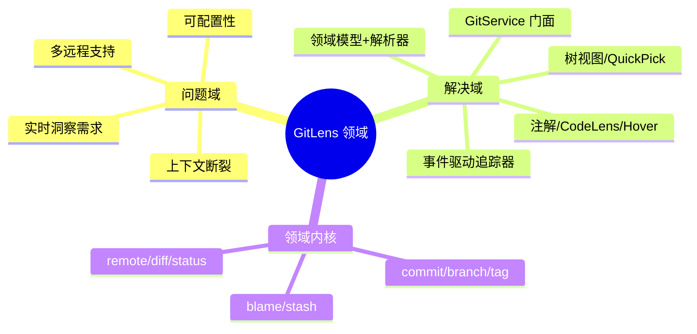

---

## 2. 战略设计（Strategic Design）

### 2.1 限界上下文（Bounded Context）

图谱社区检测（17 社区）归并出 **10 个限界上下文**，每个上下文有独立的 Ubiquitous Language（通用语言）：

| # | 限界上下文 | 核心语言（Ubiquitous Language） | 主要代码（证据） |
|---|---|---|---|
| 1 | **Git 内核上下文**（Git Core） | commit、sha、blame、branch、remote、ref | `src/git/`（gitService/git/gitUri/fsProvider/shell） |
| 2 | **命令上下文**（Commands） | 命令、preExecute、execute、args | `src/commands/`（60+ 命令类） |
| 3 | **视图上下文**（Views） | 树节点 ViewNode、treeItem、getChildren | `src/views/`（nodes/ 30+ 节点类型） |
| 4 | **快速选择上下文**（QuickPicks） | quickpick、pick、show | `src/quickpicks/`（10 个 QuickPick） |
| 5 | **注解上下文**（Annotations） | blame 注解、heatmap、gutter、provider | `src/annotations/`（4 个 provider） |
| 6 | **追踪上下文**（Trackers） | line tracker、dirty state、blame state | `src/trackers/`（gitLineTracker/gitDocumentTracker） |
| 7 | **CodeLens 上下文** | code lens、change、contributors | `src/codelens/codeLensProvider.ts` |
| 8 | **Webview 上下文** | settings、welcome、protocol 消息 | `src/webviews/`（apps/settings、apps/welcome） |
| 9 | **协作上下文**（Live Share） | vsls、host、guest、request | `src/vsls/`（host/guest/protocol） |
| 10 | **核心支撑上下文**（Core） | config、container、logger、command context | `src/configuration.ts`、`src/container.ts`、`src/logger.ts` |

### 2.2 上下文映射（Context Map）

基于图谱跨社区耦合边（CALLS/REFERENCES）判定合作关系：

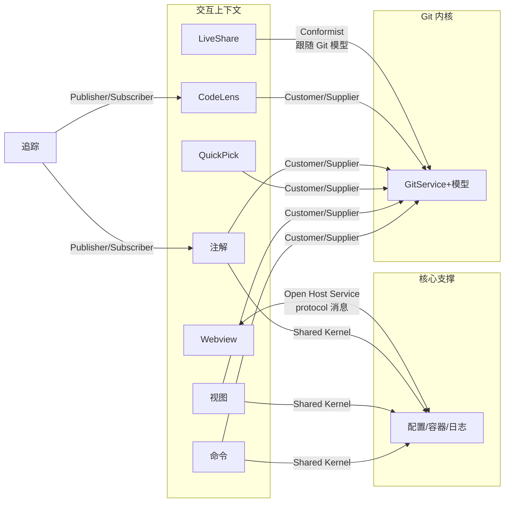

| 关系类型 | 参与方 | 证据（图谱耦合边） |
|---|---|---|
| Customer/Supplier | 命令/视图/QuickPick/注解 → Git 内核 | commands↔git **272**、git↔views **246**、git↔quickpicks **121** |
| Shared Kernel | 各交互上下文 ↔ 核心支撑 | src↔views **177**、src↔commands **150**（共享 Configuration/Container） |
| Publisher/Subscriber | 追踪上下文 → 注解/CodeLens | `onDidChangeBlameState`、`onDidChangeDirtyState`（`gitLineTracker.ts:88-90`） |
| Open Host Service | Webview ↔ 核心 | `src/webviews/protocol.ts` 定义消息协议 |
| Conformist | Live Share → Git 内核 | `src/vsls/` 复用 GitCommit/GitUri 模型 |

> ⚠️ 风险：Git 内核被 5 个上下文直接消费且无防腐层（Anti-Corruption Layer），272 条命令→git 耦合边意味着内核任何签名变更都会波及全部命令。

---

## 3. 战术设计（Tactical Design）

### 3.1 实体（Entity）

| 实体 | 身份标识（id） | 关键属性 | 证据 |
|---|---|---|---|
| `GitCommit` | `sha`（`ref` getter 返回 sha） | type、repoPath、author、email、authorDate、committerDate、message、fileName、previousSha | `src/git/models/commit.ts:45-58` |
| `GitLogCommit` | 继承 sha | +fileNames、stats、parents（日志专有） | `src/git/models/logCommit.ts:25` |
| `GitStashCommit` | 继承 sha | +stashName（stash 专有） | `src/git/models/stashCommit.ts:9` |
| `GitBlameCommit` | 继承 sha | +lineCount、lines（blame 专有） | `src/git/models/blameCommit.ts:4` |
| `GitBranch` | 名称 + 仓库 | current、remote、tracking、starred、date、upstream | `src/git/models/branch.ts:27` |
| `GitTag` | 名称 + 仓库 | commitSha、date | `src/git/models/tag.ts:6` |
| `Repository` | `id`（组合 folder+path） | folder、path、root、index、supportsChangeEvents、starred | `src/git/models/repository.ts:64` |
| `GitRemote` | 名称 + url | provider、url、domain | `src/git/models/remote.ts:11` |
| `GitReflogRecord` | 记录序号 | command、message、sha | `src/git/models/reflog.ts:15` |
| `GitContributor` | 邮箱/名称 | name、email、count、commits | `src/git/models/contributor.ts:6` |

### 3.2 值对象（Value Object）

| 值对象 | 特征（不可变/按值相等） | 证据 |
|---|---|---|
| `GitUri` | 封装 `repoPath`、`sha`、`versionedPath` 的不可变 Uri 扩展 | `src/git/gitUri.ts:43-50`（degree=109，全项目最广使用的 VO） |
| `GitAuthor` | name + email + 时间戳 | `src/git/models/commit.ts:12` |
| `GitFile` / `GitFileWithCommit` | path、originalPath、status、additions/deletions | `src/git/models/file.ts:9-18` |
| `GitDiffHunk` / `GitDiffLine` | 差异块行信息 | `src/git/models/diff.ts:5-16` |
| `GitTrackingState` | ahead/behind 跟踪状态 | `src/git/models/branch.ts:22` |
| `GitStatusFile` | 工作区文件状态 | `src/git/models/status.ts:141` |
| `GitReference` | 引用抽象（refType: revision/branch/tag） | `src/git/models/models.ts:5`（实体共同实现） |

### 3.3 领域服务（Domain Service）

| 领域服务 | 职责（不属于单个实体） | 证据 |
|---|---|---|
| `GitService` | 全部 git 命令编排：blame 分析、日志查询、diff 定位、fetch/pull/push、仓库发现 | `src/git/gitService.ts:166`（degree=181） |
| `Git`（底层命令执行） | 组装 git 参数、解析退出码、执行 shell | `src/git/git.ts:199`（948 行，`cat_file__validate` 等在 `git.ts:432-441`） |
| `GitParser` 系列 | 把 git 文本输出转为模型（blameParser/logParser/branchParser 等 11 个） | `src/git/parsers/` |
| `RemoteProvider` | 生成远程 URL（GitHub/GitLab/Bitbucket/AzDO/custom） | `src/git/remotes/provider.ts` + `factory.ts` |
| `Formatter` 系列 | commit/status 格式化渲染 | `src/git/formatters/` |
| `Container` | 依赖容器（静态单例注册表） | `src/container.ts:27`（注册 git/codeLens/trackers/views 等全部服务） |

### 3.4 领域事件（Domain Event）

| 事件 | 触发条件 | 消费者 | 证据 |
|---|---|---|---|
| `RepositoriesChanged` | 仓库新增/删除/文件系统变化（debounced fire） | 各视图 `refresh()` | `gitService.ts:167-169, 516-517` |
| `RepositoryChange`（Remotes/Stashes/Tags/Config/Closed…） | 仓库级变化（fs 监听 + 配置变化） | `Repository` 订阅者（视图、追踪器） | `repository.ts:69-71, 174-228` |
| `RepositoryFileSystemChange` | 工作区文件增删改 | 视图树刷新 | `repository.ts:74-76` |
| `LinesChange` | 光标/选区/可见行变化 | 注解 provider、CodeLens | `trackers/gitLineTracker.ts:23-31` |
| `BlameStateChange` / `DirtyStateChange` / `DirtyIdleTrigger` | blame 计算完成 / 脏状态变化 | 注解与 CodeLens 刷新 | `gitLineTracker.ts:88-90`（订阅 `tracker.onDidChangeBlameState` 等） |

### 3.5 聚合与聚合根（Aggregate / Aggregate Root）

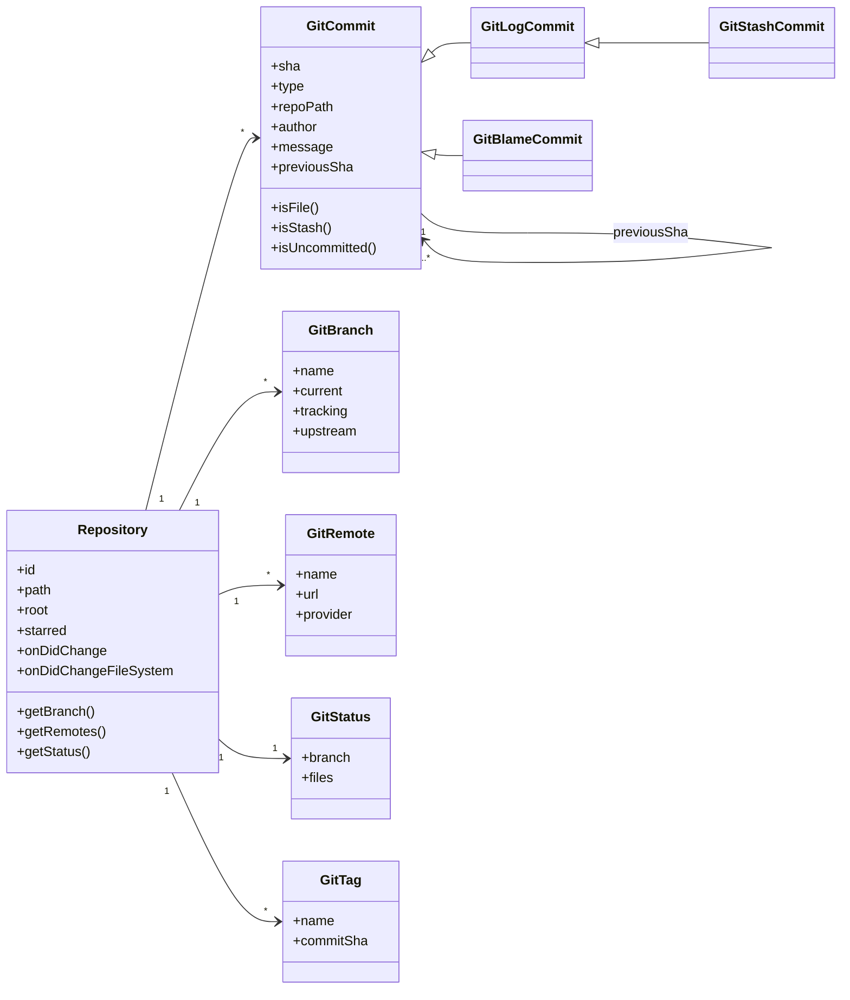

- **聚合根**：`Repository`（`src/git/models/repository.ts:64`）——持有 branch/tag/remote/status/commit 子实体，通过 `onDidChange` 事件维护内部一致性；`GitService` 是聚合的外部门面（不直接操作内部，而是经 Repository 聚合访问）
- **内部一致性规则**：`GitCommit.previousSha` 链式关系（`commit.ts:130` 附近 `previousFileSha = ${sha}^`）、`GitBranch.upstream` 与 `GitTrackingState` 联动、仓库关闭时触发 `RepositoryChange.Closed`（`repository.ts:228`）驱动订阅方清理

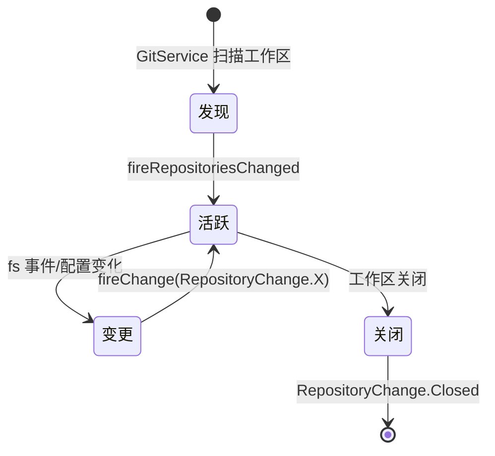

---

## 4. 架构与组织

### 4.1 架构风格

**门面（Facade）＋ 分层（Layered）＋ 事件驱动（Event-Driven）** 混合风格：

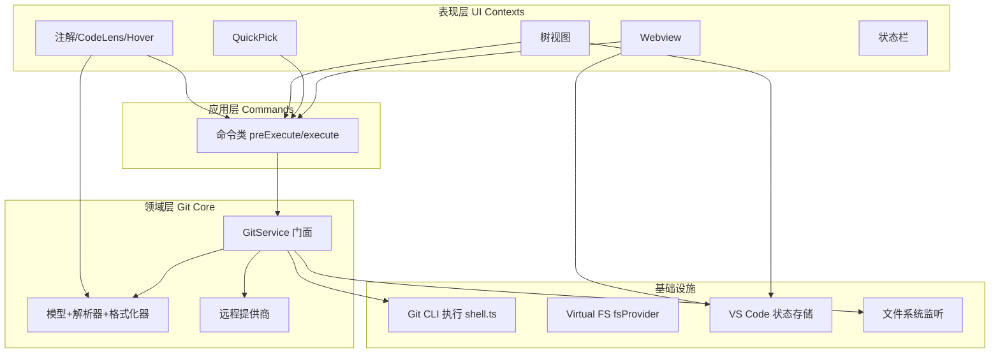

- **依赖方向**：表现层 → 命令层 → 领域层 → 基础设施（单向）；领域层不依赖 UI
- **事件驱动**：追踪器/仓库 watcher 发布事件，注解/视图订阅刷新（解耦生产-消费）

### 4.2 模块组织

```
src/
├── extension.ts        # 激活入口
├── commands.ts         # 命令汇总 barrel
├── commands/           # 命令上下文（60+ 命令类，按 gitlens.* 命令 ID 注册）
├── git/                # Git 内核上下文
│   ├── gitService.ts   #   门面（2960 行）
│   ├── git.ts          #   底层命令执行（1147 行）
│   ├── gitUri.ts       #   核心值对象
│   ├── models/         #   领域模型（16 文件）
│   ├── parsers/        #   文本解析器（11 文件）
│   ├── remotes/        #   远程提供商（6 个）
│   └── formatters/     #   格式化器
├── views/              # 视图上下文（5 视图 + nodes/ 30+ 节点）
├── quickpicks/         # QuickPick 上下文
├── annotations/        # 注解上下文（4 provider）
├── trackers/           # 追踪上下文
├── codelens/           # CodeLens 上下文
├── webviews/           # Webview 上下文（settings/welcome + protocol）
├── vsls/               # Live Share 协作上下文
├── system/             # 通用工具（array/date/promise/decorators…）
├── configuration.ts    # 配置系统（Shared Kernel）
├── container.ts        # 依赖容器（Shared Kernel）
└── logger.ts           # 日志（Shared Kernel）
```

### 4.3 依赖关系（图谱实证）

| 依赖对 | 边数 | 方向判定 |
|---|---|---|
| commands → git | 272 | 单向（命令依赖内核）✅ |
| git → views | 246 | **反向依赖** ⚠️ 视图直接消费 git 模型，但 gitService 也引用视图配置 |
| src → views | 177 | 核心支撑被视图引用（配置注入） |
| src → commands | 150 | 核心支撑被命令引用 |
| commands → quickpicks | 134 | 单向 ✅ |

> ⚠️ 依赖倒置问题：`git` 与 `views` 之间 246 条双向边，`ViewNode`（degree=183）同时被视图树与 git 模型引用，形成环——建议在视图上下文内引入视图专用模型层隔离 git 模型。

### 4.4 存储设计

GitLens **无独立数据库**——领域数据来自 git 命令实时计算，仅 UI 状态持久化到 VS Code Memento（KV 存储）：

| 存储 | 用途 | 证据 |
|---|---|---|
| `globalState`（全局 KV） | 扩展版本迁移标记 | `extension.ts:51,85`（`GlobalState.GitLensVersion`） |
| `workspaceState`（工作区 KV） | 视图配置（自动刷新开关）、pinned comparisons（固定比较）、搜索保留结果 | `repositoriesView.ts:131`、`compareView.ts:97-155`、`searchView.ts:90` |
| Git 对象库（外部） | commit/tree/blob 数据 | 经 `Git` 命令访问（`git.ts`） |

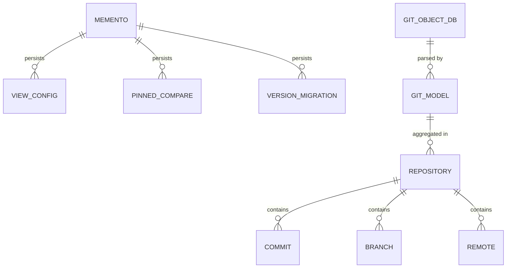

- **持久化模型 ↔ 领域模型映射**：Memento 直接存 JSON 值（无 ORM）；Git 文本 ↔ 领域模型经 `parsers/` 双向转换
- **事务边界**：无事务——命令操作 git 是外部进程级原子性；Memento 写入为单键原子更新（`workspaceState.update`）

---

## 5. 业务流程

### 5.1 扩展激活流（Activation）

- **入口**：VS Code 激活事件 → `src/extension.ts::activate`（extension.ts:17）
- **入口逻辑**：读取 `git.enabled` 配置（禁用则早退，extension.ts:48-60）；`Logger.configure` 配置日志；`Configuration.configure` 初始化配置；`migrateSettings` 版本迁移（extension.ts:51）
- **流转**：`GitService.initialize()`（try/catch + `Logger.error` 降级处理，extension.ts:64-70）→ `registerCommands` 注册全部命令（`commands/common.ts:131-135`）→ 订阅工作区事件
- **终点**：`setCommandContext(CommandContext.Enabled, true)` 启用命令上下文（extension.ts:38）

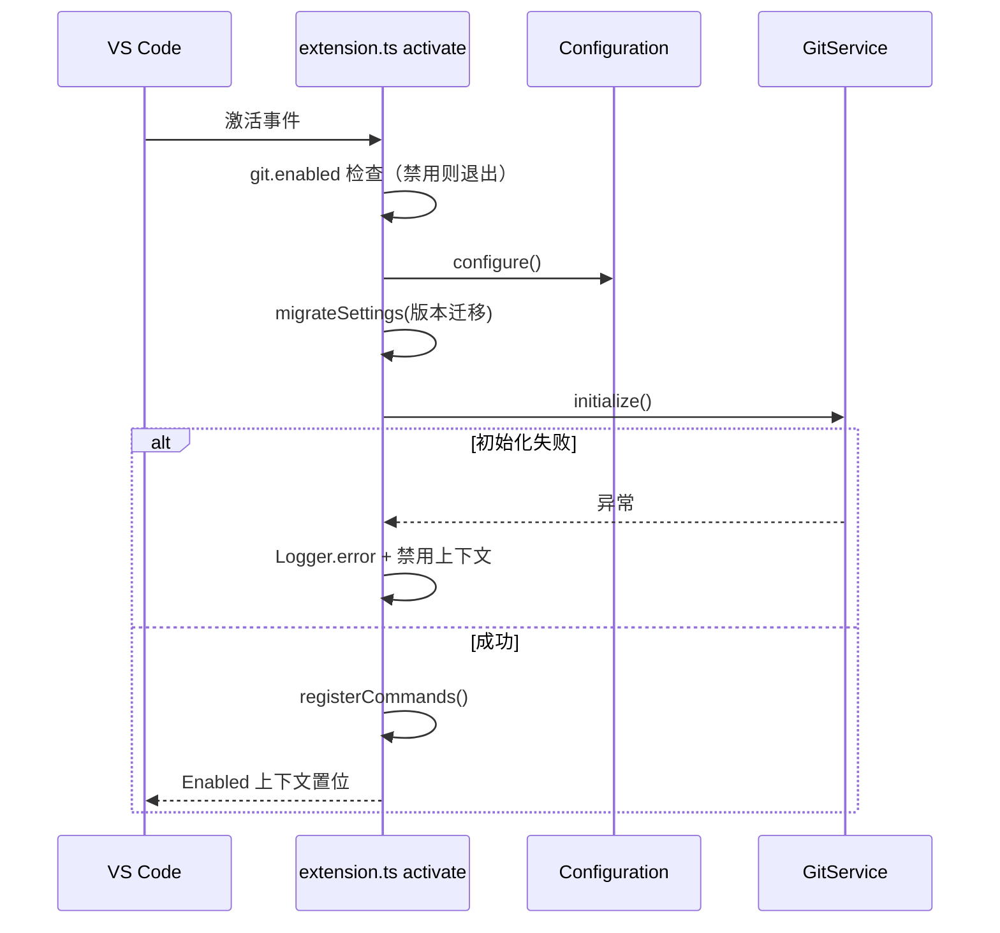

### 5.2 命令执行流（Command Execution）

- **入口**：用户命令（命令面板/快捷键/右键）→ `src/commands/showQuickCommitDetails.ts::ShowQuickCommitDetailsCommand`（`preExecute` 于 line 44）
- **入口逻辑**：`preExecute` 修正参数 → `Keyboard.beginScope` 建立快捷键作用域 → `Configuration.get` 读取配置（`configuration.ts:109-144`）→ 定位活动仓库（`getRepoPathOrActiveOrPrompt`，`commands/common.ts:147`）
- **流转**：`execute`（showQuickCommitDetails.ts:62）调用 `GitService` 查询 → `commitsQuickPick` 组装结果
- **终点**：`KeyboardScope.end` 释放作用域 → QuickPick 呈现；命令类实例在 `registerCommands` 中注册（`common.ts:131-135`）

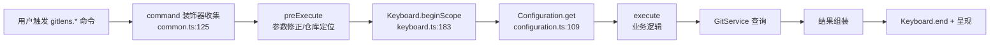

### 5.3 Blame 注解实时流（Blame Annotation）

- **入口**：光标/选区变化事件 → `src/trackers/gitLineTracker.ts::GitLineTracker`（`fireLinesChanged`，line 23）
- **入口逻辑**：`LinesChangeEvent` 携带文档与行范围 → 订阅方收到 `onActiveLinesChanged`
- **流转**：`src/annotations/blameAnnotationProvider.ts` 请求 `GitService.getBlameForLine`（gitService.ts:894）→ `blameParser.ts` 解析 → 渲染 gutter/内联注解
- **终点**：注解渲染完成并触发 `BlameStateChange`（`gitLineTracker.ts:88`）供 CodeLens/Hover 同步

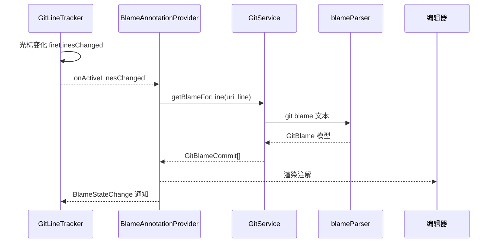

### 5.4 仓库变更刷新流（Repository Changed）

- **入口**：文件系统 watcher 事件 → `src/git/gitService.ts::fireRepositoriesChanged`（gitService.ts:516）
- **入口逻辑**：`setImmediate` 去抖合并（gitService.ts:344, 510）→ `_onDidChangeRepositories.fire()`
- **流转**：各视图 `onDidChangeRepositories` → `refresh()` → `getChildren/getTreeItem` 重建树（如 `repositoriesView.ts`）
- **终点**：视图树渲染新状态；`RepositoryChange` 细分事件（Remotes/Stashes/Tags）驱动局部刷新（repository.ts:174-228）

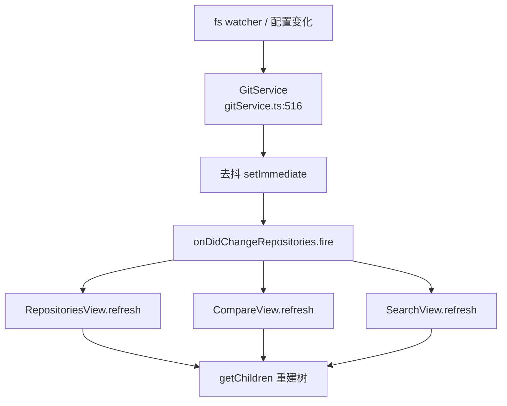

---

## 6. 接口设计

### 6.1 接口类型与契约

| 接口 | 风格 | 契约证据 |
|---|---|---|
| **VS Code 命令** | 命令 ID 字符串（`gitlens.*`），字符串常量枚举集中定义 | `src/commands/common.ts:25`（`export enum Commands`，60+ 命令 ID） |
| **Git CLI** | 子进程调用，参数数组组装 + 退出码判定 | `src/git/git.ts`（`git.ts:432-441 cat_file__validate`） |
| **远程提供商** | 面向接口编程（`RemoteProvider` 抽象 + 工厂） | `src/git/remotes/provider.ts`、`factory.ts` |
| **Webview 消息** | 自定义消息协议（request/response） | `src/webviews/protocol.ts` |
| **Live Share 协议** | 协作请求协议 | `src/vsls/protocol.ts` |
| **VS Code 事件** | `Event<T>` 发布/订阅 | `gitService.ts:168`、`repository.ts:70` |

### 6.2 命令契约设计（核心接口）

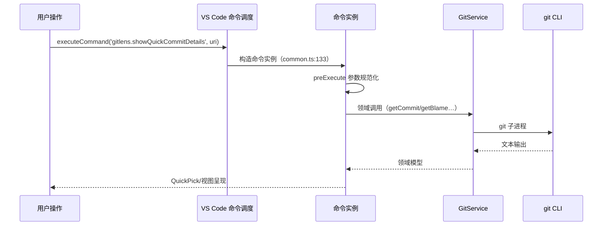

- **契约原则**：命令签名统一为 `(editor?, uri?, args?)`（证据：`showQuickCommitDetails.ts:62`）；命令参数使用类型化 `*CommandArgs` 对象（如 `ToggleFileBlameCommandArgs`）
- **版本策略**：命令 ID 前缀 `gitlens.` 命名空间；已废弃命令保留 ID 并注释 `// DEPRECATED`（`common.ts:39-43` 等），保证向后兼容
- **错误模型**：`try/catch` + `Logger.error` 记录（`extension.ts:66-70`）；`GitErrorCodes` 定义错误码（`src/@types/git.d.ts`）；用户可配置 `outputLevel` 控制日志
- **幂等与重试**：`Repository` 事件去抖（debounce，`repository.ts:88-89`）；blame 缓存于 `GitService`（按 uri+sha 缓存）——图谱证据：`@memoize()` 装饰器（`commit.ts:77, 92`）

---

## 附录 A：数据充分性声明

| 章节 | 数据充分性 | 说明 |
|---|---|---|
| 1 领域概览 | ✅ 充分 | 图谱 + README + package.json |
| 2 战略设计 | ✅ 充分 | 17 社区 + 35 对跨社区边（耦合量化） |
| 3 战术设计 | ✅ 充分 | 模型类/事件/服务均有源码行号证据 |
| 4 架构与组织 | ✅ 充分 | 图谱边方向 + 目录结构 |
| 4.4 存储 | ⚠️ 部分 | 持久化细节有限——GitLens 无独立数据库，仅 Memento KV；未发现领域级持久化模型 |
| 5 业务流程 | ✅ 充分 | 4 条核心流均有 文件:函数 入口/终点证据 |
| 6 接口设计 | ⚠️ 部分 | 重试/限流/负载均衡等运维级契约不存在（本地扩展无服务端）；幂等仅事件去抖证据 |

## 附录 B：图谱工具产出（证据索引）

- 社区与耦合：`get_architecture_overview`（17 社区、35 对边、19 告警）
- 执行流程：`list_flows`（493 条，top criticality 0.76）
- 热点：`get_knowledge_gaps`（20 未测热点、50 孤立节点）
- 巨型代码：`find_large_functions`（GitService 2794 行 / Git 948 行 / ViewCommands 925 行）
