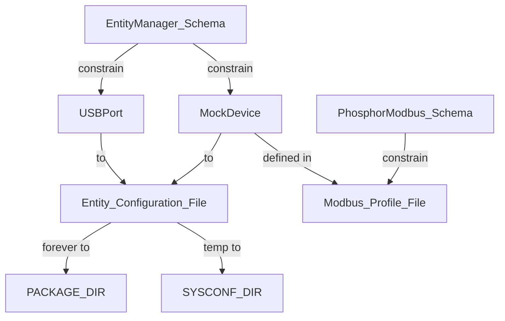

# -1 README

### 加缓存

每一次构建需要花费大量的时间和资源，为了以后的协作或修改方便，共享下载与构建缓存变得极其重要。

[Sharing Downloads and Build Cache](https://github.com/openbmc/docs/blob/master/development/dev-environment.md#sharing-downloads-and-build-cache)

根据具体情况，如果在开发机上构建过很多版本的OpenBMC，需要将命令变成：

```
mkdir -p "${HOME}/.cache/bitbake/downloads" "${HOME}/.cache/bitbake/sstate"
```

在build/conf/local.conf

```
DL_DIR = "${HOME}/.cache/bitbake/downloads"

SSTATE_DIR = "${HOME}/.cache/bitbake/sstate"

BB_HASHSERVE_DB_DIR = "${SSTATE_DIR}"
```

### 浅克隆

在构建过程中，下载的linux源码会达到10GB+量级，这是因为clone会将所有的东西都搞下来，因此浅克隆不仅会节约时间，还会节省大量资源。

Yocto 提供了 BB_GIT_SHALLOW 系列变量，可以让 fetcher 尝试只拉取 SRCREV 指向的那个 commit 及少量历史。

[BB_GIT_SHALLOW](https://docs.yoctoproject.org/bitbake/2.18/bitbake-user-manual/bitbake-user-manual-ref-variables.html#term-BB_GIT_SHALLOW)

在 build/conf/local.conf里加

```
BB_GIT_SHALLOW ?= "1"

BB_GIT_SHALLOW_DEPTH ?= "1"          # 只保留 SRCREV 那一个 commit

BB_GENERATE_SHALLOW_TARBALLS ?= "1"
```

### 跟最新

根据实践经验，最新的仓库会覆盖掉以前用旧版本时候的问题。目前从最新的仓库构建，享受到的一个唯一的好处就是，不需要经历以前那么多的版本问题。

### 终端传输镜像

开发机终端打开

`sudo bash -c 'sx --xmodem /path/to/image-bmc > /dev/ttyUSB0 < /dev/ttyUSB0'`

BMC侧打开

`loady ${loadaddr}`

### TFTP传输镜像

把需要烧录的镜像同步到tftpboot目录

`cp image-bmc /srv/tftp/`

在U-BOOT中

`setenv ipaddr 192.168.1.123  #与开发机同网段的IP`

`setenv serverip 192.168.1.100 #开发机IP`

`tftp ${loadaddr} image-bmc`

在开发机上启动TFTP服务

`sudo apt install tftpd-hpa`

`sudo mkdir -p /srv/tftp/`

`sudo chmod 777 /srv/tftp/`

`sudo systemctl restart tftpd-hpa`

还需要在开发机上配置一下目录，暂时忘记了，后续遇到再查找。

### SPI Programmer烧录镜像

# 0 锻体：SCM模块

## 0.0 需要CPLD的理由

## 0.1 钢筋铜骨：SCM设计

## 0.2 堪比合金：SCM打板验证

# 1 炼气：OpenBMC软件栈

本篇讲解OpenBMC怎么构建、上板以及使用的流程。

## 1.1 炼气一层：开发板镜像烧录

首先，在开发机上构建出镜像，然后烧录到开发板上。

### 从AspeedTech同步最新Repo

[AspeedTech OpenBMC](https://github.com/AspeedTech-BMC/openbmc)

clone最新的v11.03版本的具体流程如下：

```
git clone https://github.com/AspeedTech-BMC/openbmc aspeed_v1103

git checkout v11.03
```

### 编译OpenBMC

在源码最顶层执行

`source setup evb-ast2600`

编译

`bitbake obmc-phosphor-image`

### 适配板子？

在开发过程中遇到了问题：在Kernel拉起阶段出现

```
[    0.971405] loop: module loaded
[    0.993928] vmalloc_node_range for size 268439552 failed: Address range restricted to 0xf0800000 - 0xff800000
[    1.005104] spi-aspeed-smc 1e620000.spi: missing AHB mapping window
[    1.012128] spi-aspeed-smc 1e620000.spi: probe with driver spi-aspeed-smc failed with error -12
[    1.022089] vmalloc_node_range for size 268439552 failed: Address range restricted to 0xf0800000 - 0xff800000
[    1.033245] spi-aspeed-smc 1e630000.spi: missing AHB mapping window
[    1.040276] spi-aspeed-smc 1e630000.spi: probe with driver spi-aspeed-smc failed with error -12
[    1.058638] mdio_bus 1e650008.mdio-1: MDIO device at address 0 is missing.
[    1.067371] mdio_bus 1e650010.mdio-1: MDIO device at address 0 is missing.
```

这个问题的根源是手头上所用的BMC板子的Flash是64MB的，但是v11.03版本中的&fmc以及&spi1分配的是256MB，AHB-Window无法映射到内存，导致无法识别mtd设备，最终导致内核崩溃。

解决方案：

修改&fmc及&spi的大小适配现有的板子即大小修改为64MB，见内核patch文件。

第一个PATCH是自适应Flash大小，但是不知为何没有起作用。

[PATCH 05/10 spi: aspeed: Adjust direct mapping to device size](https://lwn.net/ml/linux-kernel/20220214094231.3753686-6-clg@kaod.org/)

第二个是报告了类似的问题。

[Call for testing: spi-mem driver for Aspeed SMC controllers](https://lists.ozlabs.org/pipermail/openbmc/2022-March/029723.html)

### 镜像上板！

最开始这是比较磨人的一部分，但是经历过了就不算啥了。

现有的镜像上板方式主要有三种：

1）利用调制传输

2）利用tftp传输

3）通过SPI Programmer烧录镜像

在最开始需要在U-Boot中执行`sf probe 0:0`以探测SPI Flash0

第一种1）主要用于tftp无法使用的时候，主要流程如下：

[终端传输](#终端传输镜像)

第二种2）主要用于可以使用tftp的时候，主要流程如下：

[TFTP传输](#tftp传输镜像)

传输完毕之后，建议使用`sf update ${loadaddr} 0x0 ${filesize}`进行更新。

当然，在一些极端情况可以使用`sf erase 0x0 ${filesize}`先擦除空间，之后使用`sf write 0x83000000 0x0 ${filesize}`进行写入。

之后`reset`重启。

第三种3）主要用于生产阶段烧录镜像，主要流程如下：

[SPI烧录](#spi-programmer烧录镜像)

## 1.2 炼气二层：内置服务安装

首先在开发机上构建服务，之后再通过包管理同步到开发板上完成安装。

### 包管理

[Loading an Application Directly Into a Running QEMU](https://github.com/openbmc/docs/blob/master/development/devtool-hello-world.md#loading-an-application-directly-into-a-running-qemu)

在 BMC 上创建 overlay 文件系统（避免改坏根文件系统）

```
mkdir -p /tmp/persist/usr /tmp/persist/work/usr

mount -t overlay -o lowerdir=/usr,upperdir=/tmp/persist/usr,workdir=/tmp/persist/work/usr overlay /usr
```

在开发阶段安装opkg管理器。

在conf/local.conf中添加安装进入镜像

```
EXTRA_IMAGE_FEATURES:append = " package-management"

IMAGE_INSTALL:append = " opkg"
```

然后在BMC端配置opkg，在/etc/opkg目录下新建customfeed.conf，并写入

`src/gz all http://192.168.1.100:8080/all`

`src/gz armv7ahf-vfpv4d16 http://192.168.1.100:8080/armv7ahf-vfpv4d16`

在开发机ipk目录启动server服务器

`python3 -m http.server 8080 &`

### 安装服务

在开发机bitbake想要的服务

注意bitbake之后需要手动更新package-index`bitbake package-index`，之后需要在BMC中执行`opkg update`，然后`opkg install <package>`。

## 1.3 炼气三层：Yocto开发流程

### 你自己的meta

[Understanding and Creating Layers](https://docs.yoctoproject.org/dev/dev-manual/layers.html)

在OpenBMC上做任何修改，最佳实践就是在自己的meta-layer中做，那么必须要先创建自己的meta-layer

`bitbake-layers create-layer meta-my`

之后将创建的layer加入到meta中

`bitbake-layers add-layer meta-my`

### 你自己的recipes

### 开发工具之quilt

[Using Quilt in Your Workflow](https://docs.yoctoproject.org/dev/dev-manual/quilt.html)

典型的quilt工作流

```
quilt new 0001-xxx.patch

quilt add file1.c file2.c

edit them

quilt refresh

copy patch to your dir
```

### 开发工具之devshell

[Using a Development Shell](https://docs.yoctoproject.org/dev/dev-manual/development-shell.html)

典型的devshell工作流

```
bitbake -c devshell virtual/kernel

exit
```

**这里为什么是virtual/kenel？**

## 1.4 炼气四层：在板上玩耍

### 为BMC配置静态IP

通过networkd进行配置

```
cd /etc/systemd/network

touch 10-eth0.network

vi 10-eth0.network

[Match]
Name=eth0

[Network]
DHCP=no
Address=192.168.1.166/24
Gateway=192.168.1.1
DNS=8.8.8.8

```
### 查看内核串口配置

**列出所有串口设备**

`ls -l /dev/ttyS*`

**查看内核识别到的串口及中断**

需要对照AST2600的数据手册查看内存地址

`cat /proc/tty/deriver/serial`

**查看系统日志中UART驱动探测记录**

`dmesg | grep -i tty`

`dmesg | grep -i uart`

**查看pinctrl当前状态：确认UART是否绑定到正确引脚组**

`cat /sys/kernel/debug/pinctrl/*/pinmux-pins 2>/dev/null | grep -i uart`

**直接用stty测试某个tty是否能设置波特率**

不能设置则说明未启用

`stty -F /dev/ttyS4 115200`

**查看obmc-console暴露了哪些console实例**

查看配置文件

`cat /etc/obmc-console/*.conf`

查看当前运行的console服务

`ps | grep -i obmc-console`

查看systemd单元

`systemctl status 'obmc-console@*'`

查看日志文件，每个host console一个

`ls -l /var/log/console-*.log`

`ls -l /var/log/obmc-cons*.log`

### entity-manager

**暂时发布一个usb port的流程**

1.put configuration in /etc/entity-manager/configurations

2.after execute start_mock_server.sh 1, need to add a configuration file according to schema usb_port.json.

this command may be helpful after execting script:

`ls -l /dev/serial/by-path/`

`systemctl restart xyz.openbmc_project.EntityManager.service`

`busctl tree xyz.openbmc_project.EntityManager`

### phosphor-modbus

**phosphor-modbus中的一些关系**



**phosphor-modbus的一些配置目录**

configuration dir in openbmc

PACKAGE_DIR : /usr/share/entity-manager/configurations : repo source configuration

PACKAGE_DIR : /usr/share/entity-manager/schema : repo source schema

SYSCONF_DIR : /etc/entity-manager/configurations : temp configuration

/var/configuration/system.json : entity-manager runtime configuration dir 

/tmp/configuration/last.json : last configuration or called cache , generated according to system.json

**为phoshpor-modbus进行mock测试**

1.复制mock server到bmc中

`scp -P 2222 \
  openbmc/phosphor-modbus/mocked_test_device/start_mock_server.sh \
  root@127.0.0.1:/usr/local/bin/start_mock_server.sh`

2.启动server脚本

`/scripts/generate_config_list.sh 1`

check the log to see whether service starts successfully, but it doesn't represent the happening of Modbus communication, must have entity manager configruation of USBPort and Modbus device.

`ls -l /dev/ttyUSB* /dev/ttyV*`
`ls -l /dev/serial/by-path/`

check entity manager whether publish USBPort and Modbus configuration

`busctl tree xyz.openbmc_project.EntityManager`

3.在modbus profile中添加一个mock设备

add a mock device file under modbus profile

this profile need to follow schema

/usr/share/phosphor-modbus/profiles/name.json

name = Type field defined in entitymanager configuration file


### phosphor-pid-control

## 1.5 炼气五层：炼丹

### 修改内核设备树

首先使用quilt

[quilt](#开发工具之quilt)

**然后跟踪要修改的设备树**

```
quilt new 0001-enable-uart1.patch

quilt add arch/arm/boot/dts/aspeed/aspeed-ast2600-evb.dts

edit

quilt refresh

copy patch to meta-mylayer
```

**在patch文件中加入上游信息**

```
From: Mickian <kaii7368616f@foxmail.com>

Data: Mon, 3 Jun 2024 15:30:00 +0800

Subject: \[PATCH] enable uart1

Upstream-Status: Inappropriate

Reason: This patch is for enabling UART1 on the AST2600 evaluation board. It modifies the device tree source file to set the status of UART1 to "okay", allowing it to be used by the system.

Signed-off-by: Mickian <kaii7368616f@foxmail.com>
```

**之后再在对应的recipes中加入bbappend**

```
在meta-mylayer/recipes-kernel/linux/linux-aspeed中加入patch文件
0001-enable-uart1.patch

在meta-mylayer/recipes-kernel/linux/中添加对应的bbappend文件
linux-aspeed_%.bbappend

.bbappend文件内容如下

FILESEXTRAPATHS:prepend := "${THISDIR}/${PN}:"
SRC_URI += "file://0001-enable-uart1.patch"
SRC_URI += "file://0002-reset-ahb-window.patch"
```

**重新构建**

```
bitbake -c cleansstate virtual/kernel

bitbake -c cleansstate obmc-phosphor-image

bitbake obmc-phosphor-image
```

# 2 筑基：CDU业务


# 3 结丹：OpenBMC体系

# 4 元婴

# 5 化神

# 6 大乘