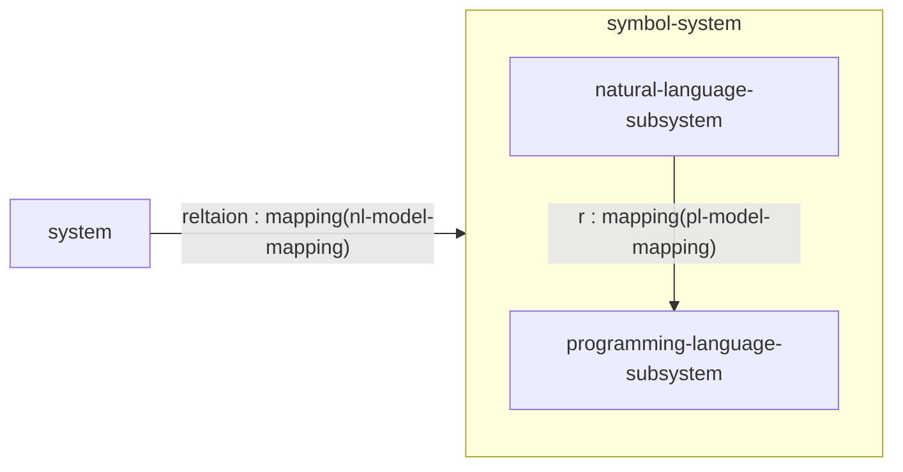

# Take modbus for an example to utilize the method

[modbus domain model](../../communication-protocol/modbus/modbus_domain_model.md)

## Meta

```mermaid
flowchart LR
    subgraph symbol-system
    natural-language-subsystem --r : mapping(pl-model-mapping)--> programming-language-subsystem
    end
    system --reltaion : mapping(nl-model-mapping)--> symbol-system
```

mapping provided by its sub system